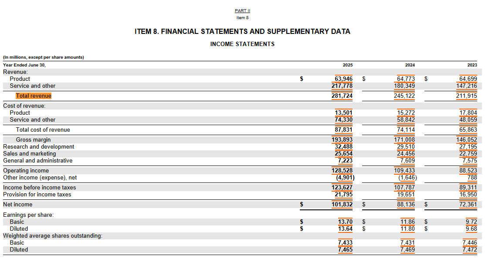
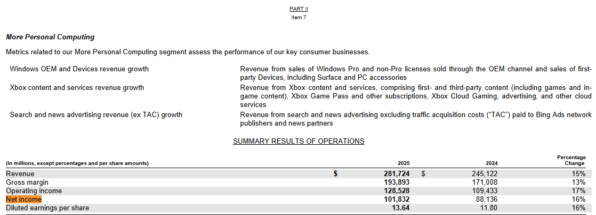
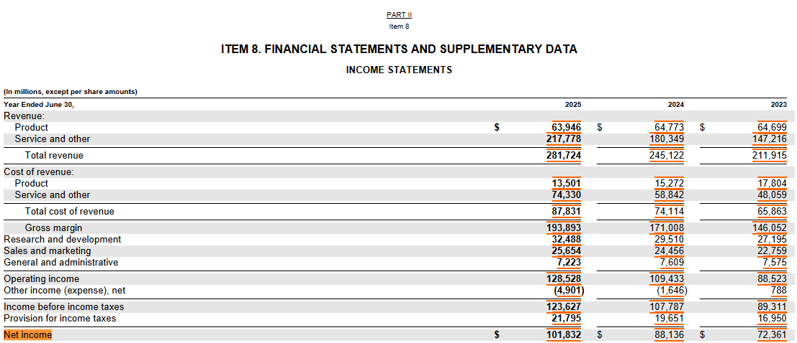
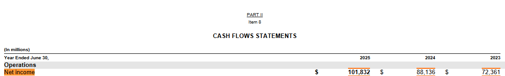
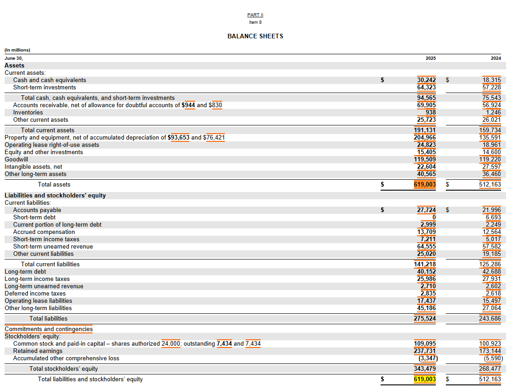
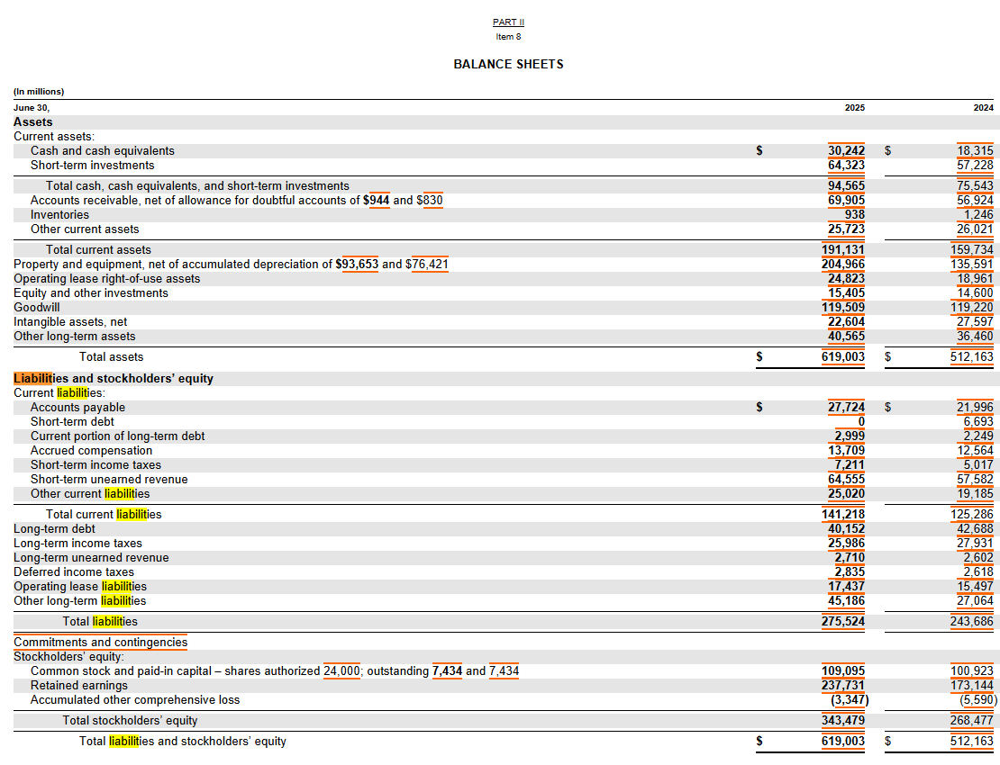
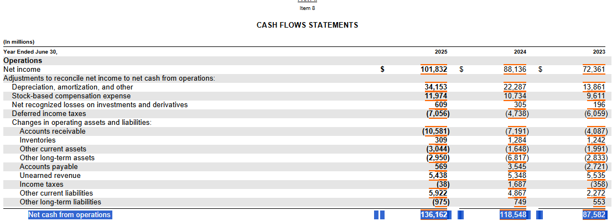
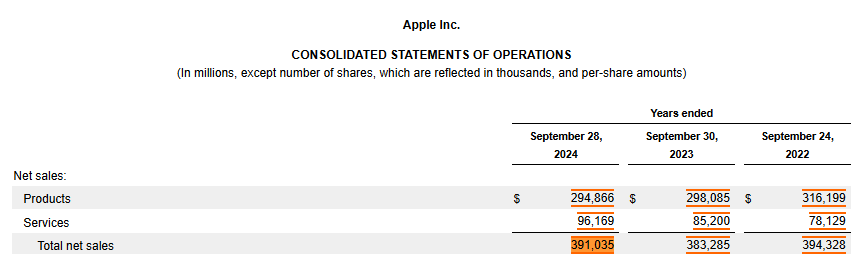

# Getting the data through scraping


<!-- WARNING: THIS FILE WAS AUTOGENERATED! DO NOT EDIT! -->

## Seting up the tools

Initiate a conda repo

> conda create -n my_env

Install the Python library to scrape data from SEC Edgar API

> uv add edgartools

Import package

Set your identity

``` python
set_identity("Ramon Pozuelo rapozueloruiz@gmail.com")
```

Now you can import Companies

``` python
apple = Company("AAPL")
# apple
```

Get the filing that we want (10 K of the previous year)

``` python
fillings = apple.get_filings(form="10-K", year=2024)
# fillings = apple.get_filings(form="10-K").latest()
```

Access the filing data

``` python
apple_latest_10K = fillings.latest()
apple_latest_10K
```

<pre style="white-space:pre;overflow-x:auto;line-height:normal;font-family:Menlo,'DejaVu Sans Mono',consolas,'Courier New',monospace"></pre>

    ╭─────────────────── Form 10-K Apple Inc. [320193]  ────────────────────╮
    │                                                                       │
    │   Accession Number       Filing Date   Period of Report   Documents   │
    │  ───────────────────────────────────────────────────────────────────  │
    │   0000320193-24-000123   2024-11-01    2024-09-28         102         │
    │                                                                       │
    ╰───────────────── Annual report for public companies ──────────────────╯

To donwload the filing content:

``` python
tenk = apple_latest_10K.obj()
tenk
```

<pre style="white-space:pre;overflow-x:auto;line-height:normal;font-family:Menlo,'DejaVu Sans Mono',consolas,'Courier New',monospace"></pre>

    ╭──────────────────────────────────────────────── Apple Inc. 10-K ────────────────────────────────────────────────╮
    │ Period ending September 28, 2024 filed on November 01, 2024                                                     │
    │                                                                                                                 │
    │                                                                                                                 │
    │ 📄                                                                                                              │
    │ ├── PART I                                                                                                      │
    │ │   ├── Item 1  Business                                                                                        │
    │ │   ├── Item 1A Risk Factors                                                                                    │
    │ │   ├── Item 1B Unresolved Staff Comments                                                                       │
    │ │   ├── Item 1C Cybersecurity                                                                                   │
    │ │   ├── Item 2  Properties                                                                                      │
    │ │   ├── Item 3  Legal Proceedings                                                                               │
    │ │   └── Item 4  Mine Safety Disclosures                                                                         │
    │ ├── PART II                                                                                                     │
    │ │   ├── Item 5  Market for Registrant’s Common Equity                                                           │
    │ │   ├── Item 6  Selected Financial Data                                                                         │
    │ │   ├── Item 7  Management’s Discussion and Analysis (MD&A)                                                     │
    │ │   ├── Item 7A Quantitative and Qualitative Disclosures About Market Risk                                      │
    │ │   ├── Item 8  Financial Statements                                                                            │
    │ │   ├── Item 9  Controls and Procedures                                                                         │
    │ │   ├── Item 9A Controls and Procedures                                                                         │
    │ │   ├── Item 9B Other Information                                                                               │
    │ │   └── Item 9C Disclosure Regarding Foreign Jurisdictions That Prevent Inspections                             │
    │ ├── PART III                                                                                                    │
    │ │   ├── Item 10 Directors, Executive Officers, and Corporate Governance                                         │
    │ │   ├── Item 11 Executive Compensation                                                                          │
    │ │   ├── Item 12 Security Ownership of Certain Beneficial Owners and Management                                  │
    │ │   ├── Item 13 Certain Relationships and Related Transactions, and Director Independence                       │
    │ │   └── Item 14 Principal Accounting Fees and Services                                                          │
    │ └── PART IV                                                                                                     │
    │     ├── Item 15 Exhibits, Financial Statement Schedules                                                         │
    │     └── Item 16 Form 10-K Summary                                                                               │
    │                                                                                                                 │
    │                                                                                                                 │
    │ ╭─────────────────────────────────────────────── XBRL Document ───────────────────────────────────────────────╮ │
    │ │            Entity Information                                                                               │ │
    │ │                                                                                                             │ │
    │ │   Property                   Value                                                                          │ │
    │ │  ───────────────────────────────────────                                                                    │ │
    │ │   entity_name                Apple Inc.                                                                     │ │
    │ │   ticker                     AAPL                                                                           │ │
    │ │   identifier                 320193                                                                         │ │
    │ │   document_type              10-K                                                                           │ │
    │ │   reporting_end_date         2024-10-18                                                                     │ │
    │ │   document_period_end_date   2024-09-28                                                                     │ │
    │ │   fiscal_year                2024                                                                           │ │
    │ │   fiscal_period              FY                                                                             │ │
    │ │   fiscal_year_end_month      9                                                                              │ │
    │ │   fiscal_year_end_day        28                                                                             │ │
    │ │   annual_report              True                                                                           │ │
    │ │   quarterly_report           False                                                                          │ │
    │ │   amendment                  False                                                                          │ │
    │ │                                                                                                             │ │
    │ │                                            Financial Statements                                             │ │
    │ │                                                                                                             │ │
    │ │   Type                        Definition                                                         Elements   │ │
    │ │  ─────────────────────────────────────────────────────────────────────────────────────────────────────────  │ │
    │ │   CoverPage                   CoverPage                                                          50         │ │
    │ │   Other                       AuditorInformation                                                 4          │ │
    │ │   IncomeStatement             CONSOLIDATEDSTATEMENTSOFOPERATIONS                                 25         │ │
    │ │   ComprehensiveIncome         CONSOLIDATEDSTATEMENTSOFCOMPREHENSIVEINCOME                        14         │ │
    │ │   BalanceSheet                CONSOLIDATEDBALANCESHEETS                                          38         │ │
    │ │   BalanceSheetParenthetical   CONSOLIDATEDBALANCESHEETSParenthetical                             5          │ │
    │ │   StatementOfEquity           CONSOLIDATEDSTATEMENTSOFSHAREHOLDERSEQUITY                         18         │ │
    │ │   CashFlowStatement           CONSOLIDATEDSTATEMENTSOFCASHFLOWS                                  35         │ │
    │ │   AccountingPolicies          SummaryofSignificantAccountingPolicies                             2          │ │
    │ │   Other                       Revenue                                                            2          │ │
    │ │   Other                       EarningsPerShare                                                   2          │ │
    │ │   Other                       FinancialInstruments                                               2          │ │
    │ │   Other                       PropertyPlantandEquipment                                          2          │ │
    │ │   Other                       ConsolidatedFinancialStatementDetails                              2          │ │
    │ │   Other                       IncomeTaxes                                                        2          │ │
    │ │   Other                       Leases                                                             3          │ │
    │ │   Other                       Debt                                                               2          │ │
    │ │   Other                       ShareholdersEquity                                                 2          │ │
    │ │   Other                       ShareBasedCompensation                                             2          │ │
    │ │   Other                       CommitmentsContingenciesandSupplyConcentrations                    2          │ │
    │ │   SegmentDisclosure           SegmentInformationandGeographicData                                2          │ │
    │ │   AccountingPolicies          SummaryofSignificantAccountingPoliciesPolicies                     14         │ │
    │ │   Other                       RevenueTables                                                      2          │ │
    │ │   Other                       EarningsPerShareTables                                             2          │ │
    │ │   Other                       FinancialInstrumentsTables                                         4          │ │
    │ │   Other                       PropertyPlantandEquipmentTables                                    2          │ │
    │ │   Other                       ConsolidatedFinancialStatementDetailsTables                        4          │ │
    │ │   Other                       IncomeTaxesTables                                                  5          │ │
    │ │   Other                       LeasesTables                                                       4          │ │
    │ │   Other                       DebtTables                                                         4          │ │
    │ │   Other                       ShareholdersEquityTables                                           2          │ │
    │ │   Other                       ShareBasedCompensationTables                                       3          │ │
    │ │   Other                       CommitmentsContingenciesandSupplyConcentrationsTables              2          │ │
    │ │   SegmentDisclosure           SegmentInformationandGeographicDataTables                          4          │ │
    │ │   Other                       RevenueAdditionalInformationDetails                                3          │ │
    │ │   Other                       RevenueNetSalesDisaggregatedbySignificantProductsandServicesDet…   11         │ │
    │ │   Other                       RevenueDeferredRevenueExpectedTimingofRealizationDetails           6          │ │
    │ │   Other                       EarningsPerShareComputationofBasicandDilutedEarningsPerShareDet…   9          │ │
    │ │   Other                       EarningsPerShareAdditionalInformationDetails                       7          │ │
    │ │   Other                       FinancialInstrumentsCashCashEquivalentsandMarketableSecuritiesD…   42         │ │
    │ │   Other                       FinancialInstrumentsAdditionalInformationDetails                   30         │ │
    │ │   Other                       FinancialInstrumentsNotionalAmountsAssociatedwithDerivativeInst…   12         │ │
    │ │   Other                       FinancialInstrumentsDerivativeInstrumentsDesignatedasFairValueH…   5          │ │
    │ │   Other                       PropertyPlantandEquipmentGrossPropertyPlantandEquipmentbyMajorA…   11         │ │
    │ │   Other                       PropertyPlantandEquipmentAdditionalInformationDetails              2          │ │
    │ │   Other                       ConsolidatedFinancialStatementDetailsOtherNonCurrentAssetsDetai…   4          │ │
    │ │   Other                       ConsolidatedFinancialStatementDetailsOtherCurrentLiabilitiesDet…   4          │ │
    │ │   Other                       ConsolidatedFinancialStatementDetailsOtherNonCurrentLiabilities…   4          │ │
    │ │   Other                       IncomeTaxesAdditionalInformationDetails                            28         │ │
    │ │   Other                       IncomeTaxesProvisionforIncomeTaxesDetails                          14         │ │
    │ │   Other                       IncomeTaxesReconciliationofProvisionforIncomeTaxestoAmountCompu…   10         │ │
    │ │   Other                       IncomeTaxesSignificantComponentsofDeferredTaxAssetsandLiabiliti…   20         │ │
    │ │   Other                       IncomeTaxesAggregateChangesinGrossUnrecognizedTaxBenefitsDetails   8          │ │
    │ │   Other                       LeasesAdditionalInformationDetails                                 19         │ │
    │ │   Other                       LeasesROUAssetsandLeaseLiabilitiesDetails                          16         │ │
    │ │   Other                       LeasesLeaseLiabilityMaturitiesDetails                              31         │ │
    │ │   Other                       DebtAdditionalInformationDetails                                   13         │ │
    │ │   Other                       DebtSummaryofCashFlowsAssociatedwithCommercialPaperDetails         8          │ │
    │ │   Other                       DebtSummaryofTermDebtDetails                                       23         │ │
    │ │   Other                       DebtFuturePrincipalPaymentsforTermDebtDetails                      8          │ │
    │ │   Other                       ShareholdersEquityAdditionalInformationDetails                     4          │ │
    │ │   StatementOfEquity           ShareholdersEquitySharesofCommonStockDetails                       10         │ │
    │ │   Other                       ShareBasedCompensationAdditionalInformationDetails                 17         │ │
    │ │   Other                       ShareBasedCompensationRestrictedStockUnitActivityandRelatedInfo…   18         │ │
    │ │   Other                       ShareBasedCompensationSummaryofShareBasedCompensationExpenseand…   3          │ │
    │ │   Other                       CommitmentsContingenciesandSupplyConcentrationsFuturePaymentsUn…   9          │ │
    │ │   SegmentDisclosure           SegmentInformationandGeographicDataInformationbyReportableSegme…   12         │ │
    │ │   SegmentDisclosure           SegmentInformationandGeographicDataReconciliationofSegmentOpera…   11         │ │
    │ │   SegmentDisclosure           SegmentInformationandGeographicDataNetSalesforCountriesthatIndi…   9          │ │
    │ │   SegmentDisclosure           SegmentInformationandGeographicDataLongLivedAssetsforCountriest…   9          │ │
    │ │   Disclosures                 AwardTimingDisclosure                                              21         │ │
    │ │   Disclosures                 ErrCompDisclosure                                                  20         │ │
    │ │   Disclosures                 PvpDisclosure                                                      54         │ │
    │ │   Other                       InsiderTradingArrangements                                         20         │ │
    │ │   Other                       InsiderTradingPoliciesProc                                         3          │ │
    │ │                                                                                                             │ │
    │ │      Facts Summary                                                                                          │ │
    │ │                                                                                                             │ │
    │ │   Category      Count                                                                                       │ │
    │ │  ─────────────────────                                                                                      │ │
    │ │   Total Facts   1127                                                                                        │ │
    │ │   Contexts      193                                                                                         │ │
    │ │   Units         7                                                                                           │ │
    │ │   Elements      684                                                                                         │ │
    │ │                                                                                                             │ │
    │ │            Reporting Periods                                                                                │ │
    │ │                                                                                                             │ │
    │ │   Type       Period                                                                                         │ │
    │ │  ─────────────────────────────────────                                                                      │ │
    │ │   Instant    2024-10-18                                                                                     │ │
    │ │   Instant    2024-09-28                                                                                     │ │
    │ │   Duration   2023-10-01 to 2024-09-28                                                                       │ │
    │ │   Duration   2024-06-30 to 2024-09-28                                                                       │ │
    │ │   Instant    2024-03-29                                                                                     │ │
    │ │   Instant    2023-09-30                                                                                     │ │
    │ │   Duration   2022-09-25 to 2023-09-30                                                                       │ │
    │ │   Instant    2022-09-24                                                                                     │ │
    │ │   Duration   2021-09-26 to 2022-09-24                                                                       │ │
    │ │   Instant    2022-03-04                                                                                     │ │
    │ │   Instant    2021-09-25                                                                                     │ │
    │ │   Instant    2016-08-30                                                                                     │ │
    │ │   Duration   2016-08-30 to 2016-08-30                                                                       │ │
    │ │                                                                                                             │ │
    │ ╰─────────────────────────────────────────────────────────────────────────────────────────────────────────────╯ │
    ╰─────────────────────────────────────────────────────────────────────────────────────────────────────────────────╯

The relevant information for the accounting is in : + Item 7
Management’s Discussion and Analysis (MD&A)

``` python
tenk["Item 7"]
```

    'Item 7.    Management’s Discussion and Analysis of Financial Condition and Results of Operations\nThe following discussion should be read in conjunction with the consolidated financial statements and accompanying notes included in Part II, Item 8 of this Form 10-K. This Item generally discusses 2024 and 2023 items and year-to-year comparisons between 2024 and 2023. Discussions of 2022 items and year-to-year comparisons between 2023 and 2022 are not included, and can be found in “Management’s Discussion and Analysis of Financial Condition and Results of Operations” in Part II, Item 7 of the Company’s Annual Report on Form 10-K for the fiscal year ended September 30, 2023.\nProduct, Service and Software Announcements\nThe Company announces new product, service and software offerings at various times during the year. Significant announcements during fiscal year 2024 included the following:\nFirst Quarter 2024:\n•MacBook Pro 14-in.;\n•MacBook Pro 16-in.; and\n•iMac.\nSecond Quarter 2024:\n•MacBook Air 13-in.; and\n•MacBook Air 15-in.\nThird Quarter 2024:\n•iPad Air;\n•iPad Pro;\n•iOS 18, macOS Sequoia, iPadOS 18, watchOS 11, visionOS 2 and tvOS 18, updates to the Company’s operating systems; and\n•Apple Intelligence™, a personal intelligence system that uses generative models.\nFourth Quarter 2024:\n•iPhone 16, iPhone 16 Plus, iPhone 16 Pro and iPhone 16 Pro Max;\n•Apple Watch Series 10; and\n•AirPods 4.\nFiscal Period\nThe Company’s fiscal year is the 52- or 53-week period that ends on the last Saturday of September. An additional week is included in the first fiscal quarter every five or six years to realign the Company’s fiscal quarters with calendar quarters, which occurred in the first quarter of 2023. The Company’s fiscal years 2024 and 2022 spanned 52 weeks each, whereas fiscal year 2023 spanned 53 weeks.\nMacroeconomic Conditions\nMacroeconomic conditions, including inflation, interest rates and currency fluctuations, have directly and indirectly impacted, and could in the future materially impact, the Company’s results of operations and financial condition.\nApple Inc. | 2024 Form 10-K | 21\n\n\nSegment Operating Performance\nThe following table shows net sales by reportable segment for 2024, 2023 and 2022 (dollars in millions):\n\n2024                                                       Change                      2023                  Change   2022                   \nAmericas                      $167,045                     3    %               $162,560                   (4)    %               $169,658   \nEurope                         101,328                     7    %                 94,294                   (1)    %                 95,118   \nGreater China                   66,952                   (8)    %                 72,559                   (2)    %                 74,200   \nJapan                           25,052                     3    %                 24,257                   (7)    %                 25,977   \nRest of Asia Pacific            30,658                     4    %                 29,615      1                   %                 29,375   \nTotal net sales               $391,035                     2    %               $383,285                   (3)    %               $394,328   \nAmericas\nAmericas net sales increased during 2024 compared to 2023 due primarily to higher net sales of Services.\nEurope\nEurope net sales increased during 2024 compared to 2023 due primarily to higher net sales of Services and iPhone.\nGreater China\nGreater China net sales decreased during 2024 compared to 2023 due primarily to lower net sales of iPhone and iPad. The weakness in the renminbi relative to the U.S. dollar had an unfavorable year-over-year impact on Greater China net sales during 2024.\nJapan\nJapan net sales increased during 2024 compared to 2023 due primarily to higher net sales of iPhone. The weakness in the yen relative to the U.S. dollar had an unfavorable year-over-year impact on Japan net sales during 2024.\nRest of Asia Pacific\nRest of Asia Pacific net sales increased during 2024 compared to 2023 due primarily to higher net sales of Services. The weakness in foreign currencies relative to the U.S. dollar had a net unfavorable year-over-year impact on Rest of Asia Pacific net sales during 2024.\nApple Inc. | 2024 Form 10-K | 22\n\n\nProducts and Services Performance\nThe following table shows net sales by category for 2024, 2023 and 2022 (dollars in millions):\n\n2024                                                                   Change                      2023                  Change   2022                   \niPhone                                    $201,183                     —    %               $200,583                   (2)    %               $205,489   \nMac                                         29,984                     2    %                 29,357                  (27)    %                 40,177   \niPad                                        26,694                   (6)    %                 28,300                   (3)    %                 29,292   \nWearables, Home and Accessories             37,005                   (7)    %                 39,845                   (3)    %                 41,241   \nServices (1)                                96,169                    13    %                 85,200      9                   %                 78,129   \nTotal net sales                           $391,035                     2    %               $383,285                   (3)    %               $394,328   \n(1)Services net sales include amortization of the deferred value of services bundled in the sales price of certain products.\niPhone\niPhone net sales were relatively flat during 2024 compared to 2023.\nMac\nMac net sales increased during 2024 compared to 2023 due primarily to higher net sales of laptops.\niPad\niPad net sales decreased during 2024 compared to 2023 due primarily to lower net sales of iPad Pro and the entry-level iPad models, partially offset by higher net sales of iPad Air.\nWearables, Home and Accessories\nWearables, Home and Accessories net sales decreased during 2024 compared to 2023 due primarily to lower net sales of Wearables and Accessories.\nServices\nServices net sales increased during 2024 compared to 2023 due primarily to higher net sales from advertising, the App Store® and cloud services.\nApple Inc. | 2024 Form 10-K | 23\n\n\nGross Margin\nProducts and Services gross margin and gross margin percentage for 2024, 2023 and 2022 were as follows (dollars in millions):\n\n2024                                        2023                      2022                   \nGross margin:                                                                                \nProducts                      $109,633                  $108,803                  $114,728   \nServices                        71,050                    60,345                    56,054   \nTotal gross margin            $180,683                  $169,148                  $170,782   \n\nGross margin percentage:                                                             \nProducts                               37.2   %           36.5   %           36.3   %\nServices                               73.9   %           70.8   %           71.7   %\nTotal gross margin percentage          46.2   %           44.1   %           43.3   %\nProducts Gross Margin\nProducts gross margin and Products gross margin percentage increased during 2024 compared to 2023 due to cost savings, partially offset by a different Products mix and the weakness in foreign currencies relative to the U.S. dollar.\nServices Gross Margin\nServices gross margin increased during 2024 compared to 2023 due primarily to higher Services net sales.\nServices gross margin percentage increased during 2024 compared to 2023 due to a different Services mix.\nThe Company’s future gross margins can be impacted by a variety of factors, as discussed in Part I, Item 1A of this Form 10-K under the heading “Risk Factors.” As a result, the Company believes, in general, gross margins will be subject to volatility and downward pressure.\nOperating Expenses\nOperating expenses for 2024, 2023 and 2022 were as follows (dollars in millions):\n\n2024                                                                     Change                     2023                  Change                     2022\nResearch and development                    $31,370                      5    %              $29,915                     14    %              $26,251    \nPercentage of total net sales                     8   %                                            8   %                                            7   %\nSelling, general and administrative         $26,097                      5    %              $24,932                    (1)    %              $25,094    \nPercentage of total net sales                     7   %                                            7   %                                            6   %\nTotal operating expenses                    $57,467                      5    %              $54,847                      7    %              $51,345    \nPercentage of total net sales                    15   %                                           14   %                                           13   %\nResearch and Development\nThe growth in R&D expense during 2024 compared to 2023 was driven primarily by increases in headcount-related expenses.\nSelling, General and Administrative\nSelling, general and administrative expense increased $1.2 billion during 2024 compared to 2023.\nApple Inc. | 2024 Form 10-K | 24\n\n\nProvision for Income Taxes\nProvision for income taxes, effective tax rate and statutory federal income tax rate for 2024, 2023 and 2022 were as follows (dollars in millions):\n\n2024                                                                        2023                     2022\nProvision for income taxes                  $29,749                  $16,741                  $19,300    \nEffective tax rate                             24.1   %                 14.7   %                 16.2   %\nStatutory federal income tax rate                21   %                   21   %                   21   %\nThe Company’s effective tax rate for 2024 was higher than the statutory federal income tax rate due primarily to a one-time income tax charge of $10.2 billion, net, related to the State Aid Decision (refer to Note 7, “Income Taxes” in the Notes to Consolidated Financial Statements in Part II, Item 8 of this Form 10-K) and state income taxes, partially offset by a lower effective tax rate on foreign earnings, the impact of the U.S. federal R&D credit, and tax benefits from share-based compensation.\nThe Company’s effective tax rate for 2024 was higher compared to 2023 due primarily to a one-time income tax charge of $10.2 billion, net, related to the State Aid Decision, a higher effective tax rate on foreign earnings and lower tax benefits from share-based compensation.\nLiquidity and Capital Resources\nThe Company believes its balances of unrestricted cash, cash equivalents and marketable securities, which totaled $140.8 billion as of September 28, 2024, along with cash generated by ongoing operations and continued access to debt markets, will be sufficient to satisfy its cash requirements and capital return program over the next 12 months and beyond.\nThe Company’s material cash requirements include the following contractual obligations:\nDebt\nAs of September 28, 2024, the Company had outstanding fixed-rate notes with varying maturities for an aggregate principal amount of $97.3 billion (collectively the “Notes”), with $10.9 billion payable within 12 months. Future interest payments associated with the Notes total $38.5 billion, with $2.6 billion payable within 12 months.\nThe Company also issues unsecured short-term promissory notes pursuant to a commercial paper program. As of September 28, 2024, the Company had $10.0 billion of commercial paper outstanding, all of which was payable within 12 months.\nLeases\nThe Company has lease arrangements for certain equipment and facilities, including corporate, data center, manufacturing and retail space. As of September 28, 2024, the Company had fixed lease payment obligations of $15.6 billion, with $2.0 billion payable within 12 months.\nManufacturing Purchase Obligations\nThe Company utilizes several outsourcing partners to manufacture subassemblies for the Company’s products and to perform final assembly and testing of finished products. The Company also obtains individual components for its products from a wide variety of individual suppliers. As of September 28, 2024, the Company had manufacturing purchase obligations of $53.0 billion, with $52.9 billion payable within 12 months.\nOther Purchase Obligations\nThe Company’s other purchase obligations primarily consist of noncancelable obligations to acquire capital assets, including assets related to product manufacturing, and noncancelable obligations related to supplier arrangements, licensed intellectual property and content, and distribution rights. As of September 28, 2024, the Company had other purchase obligations of $12.0 billion, with $4.1 billion payable within 12 months.\nDeemed Repatriation Tax Payable\nAs of September 28, 2024, the balance of the deemed repatriation tax payable imposed by the U.S. Tax Cuts and Jobs Act of 2017 (the “TCJA”) was $16.5 billion, with $7.2 billion expected to be paid within 12 months.\nApple Inc. | 2024 Form 10-K | 25\n\n\nState Aid Decision Tax Payable\nAs of September 28, 2024, the Company had an obligation to pay €14.2 billion or $15.8 billion to Ireland in connection with the State Aid Decision, all of which was expected to be paid within 12 months. The funds necessary to settle the obligation were held in escrow as of September 28, 2024, and restricted from general use.\nCapital Return Program\nIn addition to its contractual cash requirements, the Company has an authorized share repurchase program. The program does not obligate the Company to acquire a minimum amount of shares. As of September 28, 2024, the Company’s quarterly cash dividend was $0.25 per share. The Company intends to increase its dividend on an annual basis, subject to declaration by the Board.\nIn May 2024, the Company announced a new share repurchase program of up to $110 billion and raised its quarterly dividend from $0.24 to $0.25 per share beginning in May 2024. During 2024, the Company repurchased $95.0 billion of its common stock and paid dividends and dividend equivalents of $15.2 billion.\nRecent Accounting Pronouncements\nIncome Taxes\nIn December 2023, the Financial Accounting Standards Board (the “FASB”) issued Accounting Standards Update (“ASU”) No. 2023-09, Income Taxes (Topic 740): Improvements to Income Tax Disclosures (“ASU 2023-09”), which will require the Company to disclose specified additional information in its income tax rate reconciliation and provide additional information for reconciling items that meet a quantitative threshold. ASU 2023-09 will also require the Company to disaggregate its income taxes paid disclosure by federal, state and foreign taxes, with further disaggregation required for significant individual jurisdictions. The Company will adopt ASU 2023-09 in its fourth quarter of 2026 using a prospective transition method.\nSegment Reporting\nIn November 2023, the FASB issued ASU No. 2023-07, Segment Reporting (Topic 280): Improvements to Reportable Segment Disclosures (“ASU 2023-07”), which will require the Company to disclose segment expenses that are significant and regularly provided to the Company’s chief operating decision maker (“CODM”). In addition, ASU 2023-07 will require the Company to disclose the title and position of its CODM and how the CODM uses segment profit or loss information in assessing segment performance and deciding how to allocate resources. The Company will adopt ASU 2023-07 in its fourth quarter of 2025 using a retrospective transition method.\nCritical Accounting Estimates\nThe preparation of financial statements and related disclosures in conformity with U.S. generally accepted accounting principles (“GAAP”) and the Company’s discussion and analysis of its financial condition and operating results require the Company’s management to make judgments, assumptions and estimates that affect the amounts reported. Note 1, “Summary of Significant Accounting Policies” of the Notes to Consolidated Financial Statements in Part II, Item 8 of this Form 10-K describes the significant accounting policies and methods used in the preparation of the Company’s consolidated financial statements. Management bases its estimates on historical experience and on various other assumptions it believes to be reasonable under the circumstances, the results of which form the basis for making judgments about the carrying values of assets and liabilities.\nUncertain Tax Positions\nThe Company is subject to income taxes in the U.S. and numerous foreign jurisdictions. The evaluation of the Company’s uncertain tax positions involves significant judgment in the interpretation and application of GAAP and complex domestic and international tax laws, including the TCJA and the allocation of international taxation rights between countries. Although management believes the Company’s reserves are reasonable, no assurance can be given that the final outcome of these uncertainties will not be different from that reflected in the Company’s reserves. Reserves are adjusted considering changing facts and circumstances, such as the closing of a tax examination. Resolution of these uncertainties in a manner inconsistent with management’s expectations could have a material impact on the Company’s financial condition and operating results.\nLegal and Other Contingencies\nThe Company is subject to various legal proceedings and claims that arise in the ordinary course of business, the outcomes of which are inherently uncertain. The Company records a liability when it is probable that a loss has been incurred and the amount is reasonably estimable, the determination of which requires significant judgment. Resolution of legal matters in a manner inconsistent with management’s expectations could have a material impact on the Company’s financial condition and operating results.\nApple Inc. | 2024 Form 10-K | 26'

``` python
apple.balance_sheet()
```

<pre style="white-space:pre;overflow-x:auto;line-height:normal;font-family:Menlo,'DejaVu Sans Mono',consolas,'Courier New',monospace"></pre>

    ╭────────────────────────────────────────────────── Apple Inc. ───────────────────────────────────────────────────╮
    │                                                                                                                 │
    │                                                                                                                 │
    │                                                                                                                 │
    │                                                FY 2024            FY 2023           FY 2022           FY 2021   │
    │  ─────────────────────────────────────────────────────────────────────────────────────────────────────────────  │
    │   Statement of Financial Position                                                                               │
    │   [Abstract]                                                                                                    │
    │     Assets                                                                                                      │
    │       Assets                          $364,980,000,000   $352,583,000,000   $352,755,000,0…   $351,002,000,0…   │
    │       Goodwill ◦                                                                                                │
    │       Current assets: ◦                                                                                         │
    │         Assets, Current               $152,987,000,000   $143,566,000,000   $135,405,000,0…   $134,836,000,0…   │
    │         Cash and Cash Equivalents,     $29,943,000,000    $29,965,000,000   $23,646,000,000   $34,940,000,000   │
    │   at Carrying Value ◦                                                                                           │
    │         Accounts Receivable           $152,987,000,000   $143,566,000,000   $135,405,000,0…   $134,836,000,0…   │
    │   (Aggregated)                                                                                                  │
    │         Inventory                                                                                               │
    │         Prepaid Expenses ◦                                                                                      │
    │       Property, Plant and              $45,680,000,000    $43,715,000,000   $42,117,000,000   $39,440,000,000   │
    │   Equipment, Net                                                                                                │
    │         Operating lease                                                                                         │
    │   right-of-use assets ◦                                                                                         │
    │         Goodwill ◦                                                                                              │
    │         Intangible Assets                                                                                       │
    │         Other Assets, Noncurrent ◦     $74,834,000,000    $64,758,000,000   $54,428,000,000   $48,849,000,000   │
    │       Other Assets, Noncurrent ◦       $74,834,000,000    $64,758,000,000   $54,428,000,000   $48,849,000,000   │
    │         Assets                        $364,980,000,000   $352,583,000,000   $352,755,000,0…   $351,002,000,0…   │
    │     LIABILITIES AND EQUITY ◦                                                                                    │
    │       Liabilities and Equity          $364,980,000,000   $352,583,000,000   $352,755,000,0…   $351,002,000,0…   │
    │       Commitments and contingencies                                                                             │
    │   ◦                                                                                                             │
    │       Liabilities                     $308,030,000,000   $290,437,000,000   $302,083,000,0…   $287,912,000,0…   │
    │         Commitments and                                                                                         │
    │   contingencies ◦                                                                                               │
    │       Current liabilities: ◦                                                                                    │
    │         Liabilities, Current          $176,392,000,000   $145,308,000,000   $153,982,000,0…   $125,481,000,0…   │
    │         Accounts Payable ◦                                                                                      │
    │       Stockholders’ equity: ◦                                                                                   │
    │         Retained Earnings             $-19,154,000,000      $-214,000,000   $-3,068,000,000    $5,562,000,000   │
    │   (Accumulated Deficit)                                                                                         │
    │         Stockholders' Equity           $56,950,000,000    $62,146,000,000   $50,672,000,000   $63,090,000,000   │
    │   Attributable to Parent                                                                                        │
    │         Common Stock                                                                                            │
    │         Accumulated Other              $-7,172,000,000   $-11,452,000,000   $-11,109,000,0…      $163,000,000   │
    │   Comprehensive Income (Loss), Net                                                                              │
    │   of Tax                                                                                                        │
    │         Preferred Stock ◦                                                                                       │
    │     Liabilities and Equity            $364,980,000,000   $352,583,000,000   $352,755,000,0…   $351,002,000,0…   │
    │     Liabilities ◦                                                                                               │
    │       Liabilities                     $308,030,000,000   $290,437,000,000   $302,083,000,0…   $287,912,000,0…   │
    │         Commitments and                                                                                         │
    │   contingencies ◦                                                                                               │
    │       LongTermDebt                                                                                              │
    │                                                                                                                 │
    ╰────────────────────────────────────── Balance Sheet • FY 2021 to FY 2024 ───────────────────────────────────────╯

``` python
microsoft = Company("MSFT")
microsoft.balance_sheet(as_dataframe=True)
```

<div>
<style scoped>
    .dataframe tbody tr th:only-of-type {
        vertical-align: middle;
    }
&#10;    .dataframe tbody tr th {
        vertical-align: top;
    }
&#10;    .dataframe thead th {
        text-align: right;
    }
</style>

<table class="dataframe" data-quarto-postprocess="true" data-border="1">
<thead>
<tr style="text-align: right;">
<th data-quarto-table-cell-role="th"></th>
<th data-quarto-table-cell-role="th">label</th>
<th data-quarto-table-cell-role="th">depth</th>
<th data-quarto-table-cell-role="th">is_abstract</th>
<th data-quarto-table-cell-role="th">is_total</th>
<th data-quarto-table-cell-role="th">section</th>
<th data-quarto-table-cell-role="th">confidence</th>
<th data-quarto-table-cell-role="th">FY 2025</th>
<th data-quarto-table-cell-role="th">FY 2024</th>
<th data-quarto-table-cell-role="th">FY 2023</th>
<th data-quarto-table-cell-role="th">FY 2022</th>
</tr>
<tr>
<th data-quarto-table-cell-role="th">concept</th>
<th data-quarto-table-cell-role="th"></th>
<th data-quarto-table-cell-role="th"></th>
<th data-quarto-table-cell-role="th"></th>
<th data-quarto-table-cell-role="th"></th>
<th data-quarto-table-cell-role="th"></th>
<th data-quarto-table-cell-role="th"></th>
<th data-quarto-table-cell-role="th"></th>
<th data-quarto-table-cell-role="th"></th>
<th data-quarto-table-cell-role="th"></th>
<th data-quarto-table-cell-role="th"></th>
</tr>
</thead>
<tbody>
<tr>
<td
data-quarto-table-cell-role="th">StatementOfFinancialPositionAbstract</td>
<td>Statement of Financial Position [Abstract]</td>
<td>0</td>
<td>False</td>
<td>False</td>
<td>None</td>
<td>1.000000</td>
<td>NaN</td>
<td>NaN</td>
<td>NaN</td>
<td>NaN</td>
</tr>
<tr>
<td data-quarto-table-cell-role="th">AssetsAbstract</td>
<td>Assets</td>
<td>1</td>
<td>False</td>
<td>False</td>
<td>Current Assets</td>
<td>0.919881</td>
<td>NaN</td>
<td>NaN</td>
<td>NaN</td>
<td>NaN</td>
</tr>
<tr>
<td data-quarto-table-cell-role="th">Assets</td>
<td>Assets</td>
<td>2</td>
<td>False</td>
<td>True</td>
<td>None</td>
<td>0.997033</td>
<td>6.190030e+11</td>
<td>5.121630e+11</td>
<td>4.119760e+11</td>
<td>3.648400e+11</td>
</tr>
<tr>
<td data-quarto-table-cell-role="th">Goodwill</td>
<td>Goodwill</td>
<td>2</td>
<td>False</td>
<td>False</td>
<td>None</td>
<td>0.626113</td>
<td>1.195090e+11</td>
<td>1.192200e+11</td>
<td>6.788600e+10</td>
<td>6.752400e+10</td>
</tr>
<tr>
<td data-quarto-table-cell-role="th">AssetsCurrentAbstract</td>
<td>Current assets:</td>
<td>2</td>
<td>False</td>
<td>False</td>
<td>Current Assets</td>
<td>0.513353</td>
<td>NaN</td>
<td>NaN</td>
<td>NaN</td>
<td>NaN</td>
</tr>
<tr>
<td data-quarto-table-cell-role="th">AssetsCurrent</td>
<td>Assets, Current</td>
<td>3</td>
<td>False</td>
<td>True</td>
<td>Current Assets</td>
<td>0.596439</td>
<td>1.911310e+11</td>
<td>1.597340e+11</td>
<td>1.842570e+11</td>
<td>1.696840e+11</td>
</tr>
<tr>
<td
data-quarto-table-cell-role="th">CashAndCashEquivalentsAtCarryingValue</td>
<td>Cash and Cash Equivalents, at Carrying Value</td>
<td>3</td>
<td>False</td>
<td>False</td>
<td>None</td>
<td>0.768546</td>
<td>3.024200e+10</td>
<td>1.831500e+10</td>
<td>3.470400e+10</td>
<td>1.393100e+10</td>
</tr>
<tr>
<td data-quarto-table-cell-role="th">AccountsReceivableNetCurrent</td>
<td>Accounts Receivable (Aggregated)</td>
<td>3</td>
<td>False</td>
<td>True</td>
<td>None</td>
<td>0.409496</td>
<td>1.911310e+11</td>
<td>1.597340e+11</td>
<td>1.842570e+11</td>
<td>1.696840e+11</td>
</tr>
<tr>
<td
data-quarto-table-cell-role="th">PrepaidExpenseAndOtherAssetsCurrent</td>
<td>Prepaid Expenses</td>
<td>4</td>
<td>False</td>
<td>False</td>
<td>None</td>
<td>0.320475</td>
<td>NaN</td>
<td>NaN</td>
<td>NaN</td>
<td>NaN</td>
</tr>
<tr>
<td data-quarto-table-cell-role="th">AssetsCurrent</td>
<td>Assets, Current</td>
<td>5</td>
<td>False</td>
<td>True</td>
<td>Current Assets</td>
<td>0.596439</td>
<td>1.911310e+11</td>
<td>1.597340e+11</td>
<td>1.842570e+11</td>
<td>1.696840e+11</td>
</tr>
<tr>
<td data-quarto-table-cell-role="th">AssetsCurrent</td>
<td>Assets, Current</td>
<td>4</td>
<td>False</td>
<td>True</td>
<td>Current Assets</td>
<td>0.596439</td>
<td>1.911310e+11</td>
<td>1.597340e+11</td>
<td>1.842570e+11</td>
<td>1.696840e+11</td>
</tr>
<tr>
<td data-quarto-table-cell-role="th">InventoryNet</td>
<td>Inventory</td>
<td>3</td>
<td>False</td>
<td>True</td>
<td>None</td>
<td>0.412463</td>
<td>NaN</td>
<td>NaN</td>
<td>NaN</td>
<td>NaN</td>
</tr>
<tr>
<td
data-quarto-table-cell-role="th">PrepaidExpenseAndOtherAssetsCurrent</td>
<td>Prepaid Expenses</td>
<td>3</td>
<td>False</td>
<td>False</td>
<td>None</td>
<td>0.320475</td>
<td>NaN</td>
<td>NaN</td>
<td>NaN</td>
<td>NaN</td>
</tr>
<tr>
<td data-quarto-table-cell-role="th">AssetsCurrent</td>
<td>Assets, Current</td>
<td>4</td>
<td>False</td>
<td>True</td>
<td>Current Assets</td>
<td>0.596439</td>
<td>1.911310e+11</td>
<td>1.597340e+11</td>
<td>1.842570e+11</td>
<td>1.696840e+11</td>
</tr>
<tr>
<td data-quarto-table-cell-role="th">PropertyPlantAndEquipmentNet</td>
<td>Property, Plant and Equipment, Net</td>
<td>2</td>
<td>False</td>
<td>True</td>
<td>None</td>
<td>0.543027</td>
<td>2.049660e+11</td>
<td>1.355910e+11</td>
<td>9.564100e+10</td>
<td>7.439800e+10</td>
</tr>
<tr>
<td data-quarto-table-cell-role="th">OperatingLeaseRightOfUseAsset</td>
<td>Operating lease right-of-use assets</td>
<td>3</td>
<td>False</td>
<td>False</td>
<td>None</td>
<td>0.465875</td>
<td>NaN</td>
<td>NaN</td>
<td>NaN</td>
<td>NaN</td>
</tr>
<tr>
<td data-quarto-table-cell-role="th">Goodwill</td>
<td>Goodwill</td>
<td>3</td>
<td>False</td>
<td>False</td>
<td>None</td>
<td>0.626113</td>
<td>1.195090e+11</td>
<td>1.192200e+11</td>
<td>6.788600e+10</td>
<td>6.752400e+10</td>
</tr>
<tr>
<td
data-quarto-table-cell-role="th">IntangibleAssetsNetExcludingGoodwill</td>
<td>Intangible Assets</td>
<td>3</td>
<td>False</td>
<td>True</td>
<td>None</td>
<td>0.439169</td>
<td>NaN</td>
<td>NaN</td>
<td>NaN</td>
<td>NaN</td>
</tr>
<tr>
<td data-quarto-table-cell-role="th">OtherAssetsNoncurrent</td>
<td>Other Assets, Noncurrent</td>
<td>3</td>
<td>False</td>
<td>False</td>
<td>Current Assets</td>
<td>0.528190</td>
<td>4.056500e+10</td>
<td>3.646000e+10</td>
<td>3.060100e+10</td>
<td>2.189700e+10</td>
</tr>
<tr>
<td data-quarto-table-cell-role="th">Assets</td>
<td>Assets</td>
<td>4</td>
<td>False</td>
<td>True</td>
<td>None</td>
<td>0.997033</td>
<td>6.190030e+11</td>
<td>5.121630e+11</td>
<td>4.119760e+11</td>
<td>3.648400e+11</td>
</tr>
<tr>
<td data-quarto-table-cell-role="th">OtherAssetsNoncurrent</td>
<td>Other Assets, Noncurrent</td>
<td>2</td>
<td>False</td>
<td>False</td>
<td>Current Assets</td>
<td>0.528190</td>
<td>4.056500e+10</td>
<td>3.646000e+10</td>
<td>3.060100e+10</td>
<td>2.189700e+10</td>
</tr>
<tr>
<td data-quarto-table-cell-role="th">Assets</td>
<td>Assets</td>
<td>3</td>
<td>False</td>
<td>True</td>
<td>None</td>
<td>0.997033</td>
<td>6.190030e+11</td>
<td>5.121630e+11</td>
<td>4.119760e+11</td>
<td>3.648400e+11</td>
</tr>
<tr>
<td
data-quarto-table-cell-role="th">LiabilitiesAndStockholdersEquityAbstract</td>
<td>LIABILITIES AND EQUITY</td>
<td>1</td>
<td>False</td>
<td>False</td>
<td>Stockholders' Equity</td>
<td>0.724036</td>
<td>NaN</td>
<td>NaN</td>
<td>NaN</td>
<td>NaN</td>
</tr>
<tr>
<td
data-quarto-table-cell-role="th">LiabilitiesAndStockholdersEquity</td>
<td>Liabilities and Equity</td>
<td>2</td>
<td>False</td>
<td>True</td>
<td>Stockholders' Equity</td>
<td>0.976261</td>
<td>6.190030e+11</td>
<td>5.121630e+11</td>
<td>4.119760e+11</td>
<td>3.648400e+11</td>
</tr>
<tr>
<td data-quarto-table-cell-role="th">CommitmentsAndContingencies</td>
<td>Commitments and contingencies</td>
<td>2</td>
<td>False</td>
<td>False</td>
<td>None</td>
<td>0.762611</td>
<td>NaN</td>
<td>NaN</td>
<td>NaN</td>
<td>NaN</td>
</tr>
<tr>
<td data-quarto-table-cell-role="th">Liabilities</td>
<td>Liabilities</td>
<td>2</td>
<td>False</td>
<td>True</td>
<td>None</td>
<td>0.839763</td>
<td>2.755240e+11</td>
<td>2.436860e+11</td>
<td>2.057530e+11</td>
<td>1.982980e+11</td>
</tr>
<tr>
<td data-quarto-table-cell-role="th">CommitmentsAndContingencies</td>
<td>Commitments and contingencies</td>
<td>3</td>
<td>False</td>
<td>False</td>
<td>None</td>
<td>0.762611</td>
<td>NaN</td>
<td>NaN</td>
<td>NaN</td>
<td>NaN</td>
</tr>
<tr>
<td data-quarto-table-cell-role="th">LiabilitiesCurrentAbstract</td>
<td>Current liabilities:</td>
<td>2</td>
<td>False</td>
<td>False</td>
<td>Current Liabilities</td>
<td>0.531157</td>
<td>NaN</td>
<td>NaN</td>
<td>NaN</td>
<td>NaN</td>
</tr>
<tr>
<td data-quarto-table-cell-role="th">LiabilitiesCurrent</td>
<td>Liabilities, Current</td>
<td>3</td>
<td>False</td>
<td>True</td>
<td>Current Liabilities</td>
<td>0.596439</td>
<td>1.412180e+11</td>
<td>1.252860e+11</td>
<td>1.041490e+11</td>
<td>9.508200e+10</td>
</tr>
<tr>
<td data-quarto-table-cell-role="th">LongTermDebtNoncurrent</td>
<td>Long Term Debt</td>
<td>4</td>
<td>False</td>
<td>False</td>
<td>None</td>
<td>0.308605</td>
<td>NaN</td>
<td>NaN</td>
<td>NaN</td>
<td>NaN</td>
</tr>
<tr>
<td
data-quarto-table-cell-role="th">OperatingLeaseLiabilityNoncurrent</td>
<td>Operating lease liabilities</td>
<td>4</td>
<td>False</td>
<td>False</td>
<td>Non-current Liabilities</td>
<td>0.362018</td>
<td>NaN</td>
<td>NaN</td>
<td>NaN</td>
<td>NaN</td>
</tr>
<tr>
<td
data-quarto-table-cell-role="th">DeferredIncomeTaxLiabilitiesNet</td>
<td>Deferred income taxes</td>
<td>5</td>
<td>False</td>
<td>True</td>
<td>Non-current Liabilities</td>
<td>0.436202</td>
<td>NaN</td>
<td>NaN</td>
<td>NaN</td>
<td>NaN</td>
</tr>
<tr>
<td data-quarto-table-cell-role="th">OtherLiabilitiesNoncurrent</td>
<td>Other Liabilities, Noncurrent</td>
<td>4</td>
<td>False</td>
<td>False</td>
<td>Current Liabilities</td>
<td>0.501484</td>
<td>4.518600e+10</td>
<td>2.706400e+10</td>
<td>1.798100e+10</td>
<td>1.552600e+10</td>
</tr>
<tr>
<td data-quarto-table-cell-role="th">Liabilities</td>
<td>Liabilities</td>
<td>4</td>
<td>False</td>
<td>True</td>
<td>None</td>
<td>0.839763</td>
<td>2.755240e+11</td>
<td>2.436860e+11</td>
<td>2.057530e+11</td>
<td>1.982980e+11</td>
</tr>
<tr>
<td data-quarto-table-cell-role="th">CommitmentsAndContingencies</td>
<td>Commitments and contingencies</td>
<td>5</td>
<td>False</td>
<td>False</td>
<td>None</td>
<td>0.762611</td>
<td>NaN</td>
<td>NaN</td>
<td>NaN</td>
<td>NaN</td>
</tr>
<tr>
<td data-quarto-table-cell-role="th">AccountsPayableCurrent</td>
<td>Accounts Payable</td>
<td>3</td>
<td>False</td>
<td>False</td>
<td>None</td>
<td>0.459941</td>
<td>NaN</td>
<td>NaN</td>
<td>NaN</td>
<td>NaN</td>
</tr>
<tr>
<td data-quarto-table-cell-role="th">StockholdersEquityAbstract</td>
<td>Stockholders’ equity:</td>
<td>2</td>
<td>False</td>
<td>False</td>
<td>Stockholders' Equity</td>
<td>0.632047</td>
<td>NaN</td>
<td>NaN</td>
<td>NaN</td>
<td>NaN</td>
</tr>
<tr>
<td
data-quarto-table-cell-role="th">RetainedEarningsAccumulatedDeficit</td>
<td>Retained Earnings (Accumulated Deficit)</td>
<td>3</td>
<td>False</td>
<td>False</td>
<td>None</td>
<td>0.922849</td>
<td>2.377310e+11</td>
<td>1.731440e+11</td>
<td>1.188480e+11</td>
<td>8.428100e+10</td>
</tr>
<tr>
<td data-quarto-table-cell-role="th">StockholdersEquity</td>
<td>Stockholders' Equity Attributable to Parent</td>
<td>3</td>
<td>False</td>
<td>True</td>
<td>Stockholders' Equity</td>
<td>0.875371</td>
<td>3.434790e+11</td>
<td>2.684770e+11</td>
<td>2.062230e+11</td>
<td>1.665420e+11</td>
</tr>
<tr>
<td data-quarto-table-cell-role="th">MinorityInterest</td>
<td>Minority Interest</td>
<td>4</td>
<td>False</td>
<td>False</td>
<td>None</td>
<td>0.439169</td>
<td>NaN</td>
<td>NaN</td>
<td>NaN</td>
<td>NaN</td>
</tr>
<tr>
<td data-quarto-table-cell-role="th">CommonStockValue</td>
<td>Common Stock</td>
<td>3</td>
<td>False</td>
<td>False</td>
<td>None</td>
<td>0.860534</td>
<td>NaN</td>
<td>NaN</td>
<td>NaN</td>
<td>NaN</td>
</tr>
<tr>
<td data-quarto-table-cell-role="th">AdditionalPaidInCapital</td>
<td>Additional paid-in capital</td>
<td>4</td>
<td>False</td>
<td>False</td>
<td>None</td>
<td>0.501484</td>
<td>NaN</td>
<td>NaN</td>
<td>NaN</td>
<td>NaN</td>
</tr>
<tr>
<td
data-quarto-table-cell-role="th">RetainedEarningsAccumulatedDeficit</td>
<td>Retained Earnings (Accumulated Deficit)</td>
<td>4</td>
<td>False</td>
<td>False</td>
<td>None</td>
<td>0.922849</td>
<td>2.377310e+11</td>
<td>1.731440e+11</td>
<td>1.188480e+11</td>
<td>8.428100e+10</td>
</tr>
<tr>
<td
data-quarto-table-cell-role="th">AccumulatedOtherComprehensiveIncomeLossNetOfTax</td>
<td>Accumulated Other Comprehensive Income (Loss),...</td>
<td>4</td>
<td>False</td>
<td>True</td>
<td>None</td>
<td>0.777448</td>
<td>-3.347000e+09</td>
<td>-5.590000e+09</td>
<td>-6.343000e+09</td>
<td>-4.678000e+09</td>
</tr>
<tr>
<td
data-quarto-table-cell-role="th">AccumulatedOtherComprehensiveIncomeLossNetOfTax</td>
<td>Accumulated Other Comprehensive Income (Loss),...</td>
<td>3</td>
<td>False</td>
<td>True</td>
<td>None</td>
<td>0.777448</td>
<td>-3.347000e+09</td>
<td>-5.590000e+09</td>
<td>-6.343000e+09</td>
<td>-4.678000e+09</td>
</tr>
<tr>
<td data-quarto-table-cell-role="th">PreferredStockValue</td>
<td>Preferred Stock</td>
<td>3</td>
<td>False</td>
<td>False</td>
<td>None</td>
<td>0.504451</td>
<td>NaN</td>
<td>NaN</td>
<td>NaN</td>
<td>NaN</td>
</tr>
<tr>
<td
data-quarto-table-cell-role="th">LiabilitiesAndStockholdersEquity</td>
<td>Liabilities and Equity</td>
<td>1</td>
<td>False</td>
<td>True</td>
<td>Stockholders' Equity</td>
<td>0.976261</td>
<td>6.190030e+11</td>
<td>5.121630e+11</td>
<td>4.119760e+11</td>
<td>3.648400e+11</td>
</tr>
<tr>
<td data-quarto-table-cell-role="th">LiabilitiesAbstract</td>
<td>Liabilities</td>
<td>1</td>
<td>False</td>
<td>False</td>
<td>Stockholders' Equity</td>
<td>0.347181</td>
<td>NaN</td>
<td>NaN</td>
<td>NaN</td>
<td>NaN</td>
</tr>
<tr>
<td data-quarto-table-cell-role="th">Liabilities</td>
<td>Liabilities</td>
<td>2</td>
<td>False</td>
<td>True</td>
<td>None</td>
<td>0.839763</td>
<td>2.755240e+11</td>
<td>2.436860e+11</td>
<td>2.057530e+11</td>
<td>1.982980e+11</td>
</tr>
<tr>
<td data-quarto-table-cell-role="th">CommitmentsAndContingencies</td>
<td>Commitments and contingencies</td>
<td>3</td>
<td>False</td>
<td>False</td>
<td>None</td>
<td>0.762611</td>
<td>NaN</td>
<td>NaN</td>
<td>NaN</td>
<td>NaN</td>
</tr>
<tr>
<td data-quarto-table-cell-role="th">LongTermDebt</td>
<td>LongTermDebt</td>
<td>2</td>
<td>False</td>
<td>False</td>
<td>None</td>
<td>1.000000</td>
<td>NaN</td>
<td>NaN</td>
<td>NaN</td>
<td>NaN</td>
</tr>
</tbody>
</table>

</div>

``` python
df = microsoft.balance_sheet(as_dataframe=True)
```

``` python
df.head()
```

<div>
<style scoped>
    .dataframe tbody tr th:only-of-type {
        vertical-align: middle;
    }
&#10;    .dataframe tbody tr th {
        vertical-align: top;
    }
&#10;    .dataframe thead th {
        text-align: right;
    }
</style>

<table class="dataframe" data-quarto-postprocess="true" data-border="1">
<thead>
<tr style="text-align: right;">
<th data-quarto-table-cell-role="th"></th>
<th data-quarto-table-cell-role="th">label</th>
<th data-quarto-table-cell-role="th">depth</th>
<th data-quarto-table-cell-role="th">is_abstract</th>
<th data-quarto-table-cell-role="th">is_total</th>
<th data-quarto-table-cell-role="th">section</th>
<th data-quarto-table-cell-role="th">confidence</th>
<th data-quarto-table-cell-role="th">FY 2025</th>
<th data-quarto-table-cell-role="th">FY 2024</th>
<th data-quarto-table-cell-role="th">FY 2023</th>
<th data-quarto-table-cell-role="th">FY 2022</th>
</tr>
<tr>
<th data-quarto-table-cell-role="th">concept</th>
<th data-quarto-table-cell-role="th"></th>
<th data-quarto-table-cell-role="th"></th>
<th data-quarto-table-cell-role="th"></th>
<th data-quarto-table-cell-role="th"></th>
<th data-quarto-table-cell-role="th"></th>
<th data-quarto-table-cell-role="th"></th>
<th data-quarto-table-cell-role="th"></th>
<th data-quarto-table-cell-role="th"></th>
<th data-quarto-table-cell-role="th"></th>
<th data-quarto-table-cell-role="th"></th>
</tr>
</thead>
<tbody>
<tr>
<td
data-quarto-table-cell-role="th">StatementOfFinancialPositionAbstract</td>
<td>Statement of Financial Position [Abstract]</td>
<td>0</td>
<td>False</td>
<td>False</td>
<td>None</td>
<td>1.000000</td>
<td>NaN</td>
<td>NaN</td>
<td>NaN</td>
<td>NaN</td>
</tr>
<tr>
<td data-quarto-table-cell-role="th">AssetsAbstract</td>
<td>Assets</td>
<td>1</td>
<td>False</td>
<td>False</td>
<td>Current Assets</td>
<td>0.919881</td>
<td>NaN</td>
<td>NaN</td>
<td>NaN</td>
<td>NaN</td>
</tr>
<tr>
<td data-quarto-table-cell-role="th">Assets</td>
<td>Assets</td>
<td>2</td>
<td>False</td>
<td>True</td>
<td>None</td>
<td>0.997033</td>
<td>6.190030e+11</td>
<td>5.121630e+11</td>
<td>4.119760e+11</td>
<td>3.648400e+11</td>
</tr>
<tr>
<td data-quarto-table-cell-role="th">Goodwill</td>
<td>Goodwill</td>
<td>2</td>
<td>False</td>
<td>False</td>
<td>None</td>
<td>0.626113</td>
<td>1.195090e+11</td>
<td>1.192200e+11</td>
<td>6.788600e+10</td>
<td>6.752400e+10</td>
</tr>
<tr>
<td data-quarto-table-cell-role="th">AssetsCurrentAbstract</td>
<td>Current assets:</td>
<td>2</td>
<td>False</td>
<td>False</td>
<td>Current Assets</td>
<td>0.513353</td>
<td>NaN</td>
<td>NaN</td>
<td>NaN</td>
<td>NaN</td>
</tr>
</tbody>
</table>

</div>

# Manual notes

📈 **Total Revenue**  
+ **What it is**: The total amount of money a company earns from its
business activities, like selling products or services, before any costs
or expenses are deducted.

- **Where it appears**: First line of the Income Statement (also called
  the Consolidated Statement of Operations).

- **Why it matters**: It shows the company’s ability to generate sales.

💰 **Net Income** + **What it is**: The company’s profit after
subtracting all expenses, taxes, and costs from total revenue.

- Formula:  
  \> Net Income = Total Revenue - Total Expenses

- **Where it appears**: Bottom line of the Income Statement.

- **Why it matters**: It reflects the company’s overall profitability1 .

🏢 **Total Assets** What it is: Everything the company owns that has
value—cash, inventory, buildings, equipment, patents, etc.

- **Where it appears**: Top half of the Balance Sheet.

- **Why it matters**: It shows the scale and resource base of the
  company

📉 **Total Liabilities** + **What it is**: All the debts and obligations
the company owes—loans, accounts payable, accrued expenses, etc.

- **Where it appears**: Bottom half of the Balance Sheet, usually under
  or alongside shareholders’ equity.

- **Why it matters**: It indicates how much the company owes and its
  financial risk exposure2 .

🔄 **Cash Flow from Operating Activities** + **What it is**: The cash
generated or used by the company’s core business operations (e.g.,
selling products, paying suppliers).

- **Where it appears**: First section of the Cash Flow Statement.

- **Why it matters**: It shows whether the company’s day-to-day
  operations are generating enough cash to sustain the business .

``` python
columns = ["Company", "Year",
            "Total Revenue", "Net Income", 
            "Total Assets", "Total Liabilities", 
            "Cash Flow from Operations"]
```

``` python
# In millions except for share amounts 
rows = [
      # [" company ", year, TReven, NIncome, TAssets, TLiab, CashFlOp
        ["Microsoft", 2025, 281724, 101832, 619003, 191791, 93520],
        ["Microsoft", 2024, 245122, 88136,  512163,  ],
        ["Microsoft", 2023, 211915, 72,361,   ],
        ["Apple", 2024, 391035, 101832, 619003, 191791, 93520],
        ["Apple", 2023, 383285, 101832, 619003, 191791, 93520],
        ["Apple", 2022, 394328, 101832, 619003, 191791, 93520],
        
        ]
```

Microsoft 10K

<figure>

<figcaption aria-hidden="true">image.png</figcaption>
</figure>

Microsoft Net income

<figure>

<figcaption aria-hidden="true">image.png</figcaption>
</figure>

<figure>

<figcaption aria-hidden="true">image.png</figcaption>
</figure>

<figure>

<figcaption aria-hidden="true">image.png</figcaption>
</figure>

Net income appears in multiple places and with the same values. In the
previous pictures: Item 7, Item 8 (Income Statements), Item 8 (Cash Flow
Statements), Item 8 (Income Statements), Item 8 (STOCKHOLDERS’ EQUITY
STATEMENTS)

Total Assets: In Balance Sheets  
| 2025 | 2024 | |———–|———| | $ 619,003 | $512,163|

<figure>

<figcaption aria-hidden="true">image.png</figcaption>
</figure>

Liabilities

<figure>

<figcaption aria-hidden="true">image.png</figcaption>
</figure>

Cash Flow

<figure>

<figcaption aria-hidden="true">image.png</figcaption>
</figure>

Apple

Total revenue / Total net sales

<figure>

<figcaption aria-hidden="true">image.png</figcaption>
</figure>

# Test to get the total revenue for apple and microsoft

With this code I get the full text of each section or “Item”

``` python
apple10k = apple.get_filings(form="10-K").latest().obj()
print(apple10k.items)
print(100*"-")
print()
n="7"
print(apple10k[f"Item {n}"])
```

    ['Item 1', 'Item 1A', 'Item 1B', 'Item 1C', 'Item 2', 'Item 3', 'Item 4', 'Item 5', 'Item 6', 'Item 7', 'Item 7A', 'Item 8', 'Item 9', 'Item 9A', 'Item 9B', 'Item 9C', 'Item 10', 'Item 11', 'Item 12', 'Item 13', 'Item 14', 'Item 15', 'Item 16']
    ----------------------------------------------------------------------------------------------------

    Item 7.    Management’s Discussion and Analysis of Financial Condition and Results of Operations
    The following discussion should be read in conjunction with the consolidated financial statements and accompanying notes included in Part II, Item 8 of this Form 10-K. This Item generally discusses 2024 and 2023 items and year-to-year comparisons between 2024 and 2023. Discussions of 2022 items and year-to-year comparisons between 2023 and 2022 are not included, and can be found in “Management’s Discussion and Analysis of Financial Condition and Results of Operations” in Part II, Item 7 of the Company’s Annual Report on Form 10-K for the fiscal year ended September 30, 2023.
    Product, Service and Software Announcements
    The Company announces new product, service and software offerings at various times during the year. Significant announcements during fiscal year 2024 included the following:
    First Quarter 2024:
    •MacBook Pro 14-in.;
    •MacBook Pro 16-in.; and
    •iMac.
    Second Quarter 2024:
    •MacBook Air 13-in.; and
    •MacBook Air 15-in.
    Third Quarter 2024:
    •iPad Air;
    •iPad Pro;
    •iOS 18, macOS Sequoia, iPadOS 18, watchOS 11, visionOS 2 and tvOS 18, updates to the Company’s operating systems; and
    •Apple Intelligence™, a personal intelligence system that uses generative models.
    Fourth Quarter 2024:
    •iPhone 16, iPhone 16 Plus, iPhone 16 Pro and iPhone 16 Pro Max;
    •Apple Watch Series 10; and
    •AirPods 4.
    Fiscal Period
    The Company’s fiscal year is the 52- or 53-week period that ends on the last Saturday of September. An additional week is included in the first fiscal quarter every five or six years to realign the Company’s fiscal quarters with calendar quarters, which occurred in the first quarter of 2023. The Company’s fiscal years 2024 and 2022 spanned 52 weeks each, whereas fiscal year 2023 spanned 53 weeks.
    Macroeconomic Conditions
    Macroeconomic conditions, including inflation, interest rates and currency fluctuations, have directly and indirectly impacted, and could in the future materially impact, the Company’s results of operations and financial condition.
    Apple Inc. | 2024 Form 10-K | 21


    Segment Operating Performance
    The following table shows net sales by reportable segment for 2024, 2023 and 2022 (dollars in millions):

    2024                                                       Change                      2023                  Change   2022                   
    Americas                      $167,045                     3    %               $162,560                   (4)    %               $169,658   
    Europe                         101,328                     7    %                 94,294                   (1)    %                 95,118   
    Greater China                   66,952                   (8)    %                 72,559                   (2)    %                 74,200   
    Japan                           25,052                     3    %                 24,257                   (7)    %                 25,977   
    Rest of Asia Pacific            30,658                     4    %                 29,615      1                   %                 29,375   
    Total net sales               $391,035                     2    %               $383,285                   (3)    %               $394,328   
    Americas
    Americas net sales increased during 2024 compared to 2023 due primarily to higher net sales of Services.
    Europe
    Europe net sales increased during 2024 compared to 2023 due primarily to higher net sales of Services and iPhone.
    Greater China
    Greater China net sales decreased during 2024 compared to 2023 due primarily to lower net sales of iPhone and iPad. The weakness in the renminbi relative to the U.S. dollar had an unfavorable year-over-year impact on Greater China net sales during 2024.
    Japan
    Japan net sales increased during 2024 compared to 2023 due primarily to higher net sales of iPhone. The weakness in the yen relative to the U.S. dollar had an unfavorable year-over-year impact on Japan net sales during 2024.
    Rest of Asia Pacific
    Rest of Asia Pacific net sales increased during 2024 compared to 2023 due primarily to higher net sales of Services. The weakness in foreign currencies relative to the U.S. dollar had a net unfavorable year-over-year impact on Rest of Asia Pacific net sales during 2024.
    Apple Inc. | 2024 Form 10-K | 22


    Products and Services Performance
    The following table shows net sales by category for 2024, 2023 and 2022 (dollars in millions):

    2024                                                                   Change                      2023                  Change   2022                   
    iPhone                                    $201,183                     —    %               $200,583                   (2)    %               $205,489   
    Mac                                         29,984                     2    %                 29,357                  (27)    %                 40,177   
    iPad                                        26,694                   (6)    %                 28,300                   (3)    %                 29,292   
    Wearables, Home and Accessories             37,005                   (7)    %                 39,845                   (3)    %                 41,241   
    Services (1)                                96,169                    13    %                 85,200      9                   %                 78,129   
    Total net sales                           $391,035                     2    %               $383,285                   (3)    %               $394,328   
    (1)Services net sales include amortization of the deferred value of services bundled in the sales price of certain products.
    iPhone
    iPhone net sales were relatively flat during 2024 compared to 2023.
    Mac
    Mac net sales increased during 2024 compared to 2023 due primarily to higher net sales of laptops.
    iPad
    iPad net sales decreased during 2024 compared to 2023 due primarily to lower net sales of iPad Pro and the entry-level iPad models, partially offset by higher net sales of iPad Air.
    Wearables, Home and Accessories
    Wearables, Home and Accessories net sales decreased during 2024 compared to 2023 due primarily to lower net sales of Wearables and Accessories.
    Services
    Services net sales increased during 2024 compared to 2023 due primarily to higher net sales from advertising, the App Store® and cloud services.
    Apple Inc. | 2024 Form 10-K | 23


    Gross Margin
    Products and Services gross margin and gross margin percentage for 2024, 2023 and 2022 were as follows (dollars in millions):

    2024                                        2023                      2022                   
    Gross margin:                                                                                
    Products                      $109,633                  $108,803                  $114,728   
    Services                        71,050                    60,345                    56,054   
    Total gross margin            $180,683                  $169,148                  $170,782   

    Gross margin percentage:                                                             
    Products                               37.2   %           36.5   %           36.3   %
    Services                               73.9   %           70.8   %           71.7   %
    Total gross margin percentage          46.2   %           44.1   %           43.3   %
    Products Gross Margin
    Products gross margin and Products gross margin percentage increased during 2024 compared to 2023 due to cost savings, partially offset by a different Products mix and the weakness in foreign currencies relative to the U.S. dollar.
    Services Gross Margin
    Services gross margin increased during 2024 compared to 2023 due primarily to higher Services net sales.
    Services gross margin percentage increased during 2024 compared to 2023 due to a different Services mix.
    The Company’s future gross margins can be impacted by a variety of factors, as discussed in Part I, Item 1A of this Form 10-K under the heading “Risk Factors.” As a result, the Company believes, in general, gross margins will be subject to volatility and downward pressure.
    Operating Expenses
    Operating expenses for 2024, 2023 and 2022 were as follows (dollars in millions):

    2024                                                                     Change                     2023                  Change                     2022
    Research and development                    $31,370                      5    %              $29,915                     14    %              $26,251    
    Percentage of total net sales                     8   %                                            8   %                                            7   %
    Selling, general and administrative         $26,097                      5    %              $24,932                    (1)    %              $25,094    
    Percentage of total net sales                     7   %                                            7   %                                            6   %
    Total operating expenses                    $57,467                      5    %              $54,847                      7    %              $51,345    
    Percentage of total net sales                    15   %                                           14   %                                           13   %
    Research and Development
    The growth in R&D expense during 2024 compared to 2023 was driven primarily by increases in headcount-related expenses.
    Selling, General and Administrative
    Selling, general and administrative expense increased $1.2 billion during 2024 compared to 2023.
    Apple Inc. | 2024 Form 10-K | 24


    Provision for Income Taxes
    Provision for income taxes, effective tax rate and statutory federal income tax rate for 2024, 2023 and 2022 were as follows (dollars in millions):

    2024                                                                        2023                     2022
    Provision for income taxes                  $29,749                  $16,741                  $19,300    
    Effective tax rate                             24.1   %                 14.7   %                 16.2   %
    Statutory federal income tax rate                21   %                   21   %                   21   %
    The Company’s effective tax rate for 2024 was higher than the statutory federal income tax rate due primarily to a one-time income tax charge of $10.2 billion, net, related to the State Aid Decision (refer to Note 7, “Income Taxes” in the Notes to Consolidated Financial Statements in Part II, Item 8 of this Form 10-K) and state income taxes, partially offset by a lower effective tax rate on foreign earnings, the impact of the U.S. federal R&D credit, and tax benefits from share-based compensation.
    The Company’s effective tax rate for 2024 was higher compared to 2023 due primarily to a one-time income tax charge of $10.2 billion, net, related to the State Aid Decision, a higher effective tax rate on foreign earnings and lower tax benefits from share-based compensation.
    Liquidity and Capital Resources
    The Company believes its balances of unrestricted cash, cash equivalents and marketable securities, which totaled $140.8 billion as of September 28, 2024, along with cash generated by ongoing operations and continued access to debt markets, will be sufficient to satisfy its cash requirements and capital return program over the next 12 months and beyond.
    The Company’s material cash requirements include the following contractual obligations:
    Debt
    As of September 28, 2024, the Company had outstanding fixed-rate notes with varying maturities for an aggregate principal amount of $97.3 billion (collectively the “Notes”), with $10.9 billion payable within 12 months. Future interest payments associated with the Notes total $38.5 billion, with $2.6 billion payable within 12 months.
    The Company also issues unsecured short-term promissory notes pursuant to a commercial paper program. As of September 28, 2024, the Company had $10.0 billion of commercial paper outstanding, all of which was payable within 12 months.
    Leases
    The Company has lease arrangements for certain equipment and facilities, including corporate, data center, manufacturing and retail space. As of September 28, 2024, the Company had fixed lease payment obligations of $15.6 billion, with $2.0 billion payable within 12 months.
    Manufacturing Purchase Obligations
    The Company utilizes several outsourcing partners to manufacture subassemblies for the Company’s products and to perform final assembly and testing of finished products. The Company also obtains individual components for its products from a wide variety of individual suppliers. As of September 28, 2024, the Company had manufacturing purchase obligations of $53.0 billion, with $52.9 billion payable within 12 months.
    Other Purchase Obligations
    The Company’s other purchase obligations primarily consist of noncancelable obligations to acquire capital assets, including assets related to product manufacturing, and noncancelable obligations related to supplier arrangements, licensed intellectual property and content, and distribution rights. As of September 28, 2024, the Company had other purchase obligations of $12.0 billion, with $4.1 billion payable within 12 months.
    Deemed Repatriation Tax Payable
    As of September 28, 2024, the balance of the deemed repatriation tax payable imposed by the U.S. Tax Cuts and Jobs Act of 2017 (the “TCJA”) was $16.5 billion, with $7.2 billion expected to be paid within 12 months.
    Apple Inc. | 2024 Form 10-K | 25


    State Aid Decision Tax Payable
    As of September 28, 2024, the Company had an obligation to pay €14.2 billion or $15.8 billion to Ireland in connection with the State Aid Decision, all of which was expected to be paid within 12 months. The funds necessary to settle the obligation were held in escrow as of September 28, 2024, and restricted from general use.
    Capital Return Program
    In addition to its contractual cash requirements, the Company has an authorized share repurchase program. The program does not obligate the Company to acquire a minimum amount of shares. As of September 28, 2024, the Company’s quarterly cash dividend was $0.25 per share. The Company intends to increase its dividend on an annual basis, subject to declaration by the Board.
    In May 2024, the Company announced a new share repurchase program of up to $110 billion and raised its quarterly dividend from $0.24 to $0.25 per share beginning in May 2024. During 2024, the Company repurchased $95.0 billion of its common stock and paid dividends and dividend equivalents of $15.2 billion.
    Recent Accounting Pronouncements
    Income Taxes
    In December 2023, the Financial Accounting Standards Board (the “FASB”) issued Accounting Standards Update (“ASU”) No. 2023-09, Income Taxes (Topic 740): Improvements to Income Tax Disclosures (“ASU 2023-09”), which will require the Company to disclose specified additional information in its income tax rate reconciliation and provide additional information for reconciling items that meet a quantitative threshold. ASU 2023-09 will also require the Company to disaggregate its income taxes paid disclosure by federal, state and foreign taxes, with further disaggregation required for significant individual jurisdictions. The Company will adopt ASU 2023-09 in its fourth quarter of 2026 using a prospective transition method.
    Segment Reporting
    In November 2023, the FASB issued ASU No. 2023-07, Segment Reporting (Topic 280): Improvements to Reportable Segment Disclosures (“ASU 2023-07”), which will require the Company to disclose segment expenses that are significant and regularly provided to the Company’s chief operating decision maker (“CODM”). In addition, ASU 2023-07 will require the Company to disclose the title and position of its CODM and how the CODM uses segment profit or loss information in assessing segment performance and deciding how to allocate resources. The Company will adopt ASU 2023-07 in its fourth quarter of 2025 using a retrospective transition method.
    Critical Accounting Estimates
    The preparation of financial statements and related disclosures in conformity with U.S. generally accepted accounting principles (“GAAP”) and the Company’s discussion and analysis of its financial condition and operating results require the Company’s management to make judgments, assumptions and estimates that affect the amounts reported. Note 1, “Summary of Significant Accounting Policies” of the Notes to Consolidated Financial Statements in Part II, Item 8 of this Form 10-K describes the significant accounting policies and methods used in the preparation of the Company’s consolidated financial statements. Management bases its estimates on historical experience and on various other assumptions it believes to be reasonable under the circumstances, the results of which form the basis for making judgments about the carrying values of assets and liabilities.
    Uncertain Tax Positions
    The Company is subject to income taxes in the U.S. and numerous foreign jurisdictions. The evaluation of the Company’s uncertain tax positions involves significant judgment in the interpretation and application of GAAP and complex domestic and international tax laws, including the TCJA and the allocation of international taxation rights between countries. Although management believes the Company’s reserves are reasonable, no assurance can be given that the final outcome of these uncertainties will not be different from that reflected in the Company’s reserves. Reserves are adjusted considering changing facts and circumstances, such as the closing of a tax examination. Resolution of these uncertainties in a manner inconsistent with management’s expectations could have a material impact on the Company’s financial condition and operating results.
    Legal and Other Contingencies
    The Company is subject to various legal proceedings and claims that arise in the ordinary course of business, the outcomes of which are inherently uncertain. The Company records a liability when it is probable that a loss has been incurred and the amount is reasonably estimable, the determination of which requires significant judgment. Resolution of legal matters in a manner inconsistent with management’s expectations could have a material impact on the Company’s financial condition and operating results.
    Apple Inc. | 2024 Form 10-K | 26

Now Let’s try to import with xbrl

``` python
apple10k = apple.get_filings(form="10-K").latest().xbrl()
display(apple10k)
```

<pre style="white-space:pre;overflow-x:auto;line-height:normal;font-family:Menlo,'DejaVu Sans Mono',consolas,'Courier New',monospace"></pre>

    ╭───────────────────────────────────────────────── XBRL Document ─────────────────────────────────────────────────╮
    │            Entity Information                                                                                   │
    │                                                                                                                 │
    │   Property                   Value                                                                              │
    │  ───────────────────────────────────────                                                                        │
    │   entity_name                Apple Inc.                                                                         │
    │   ticker                     AAPL                                                                               │
    │   identifier                 320193                                                                             │
    │   document_type              10-K                                                                               │
    │   reporting_end_date         2024-10-18                                                                         │
    │   document_period_end_date   2024-09-28                                                                         │
    │   fiscal_year                2024                                                                               │
    │   fiscal_period              FY                                                                                 │
    │   fiscal_year_end_month      9                                                                                  │
    │   fiscal_year_end_day        28                                                                                 │
    │   annual_report              True                                                                               │
    │   quarterly_report           False                                                                              │
    │   amendment                  False                                                                              │
    │                                                                                                                 │
    │                                              Financial Statements                                               │
    │                                                                                                                 │
    │   Type                        Definition                                                             Elements   │
    │  ─────────────────────────────────────────────────────────────────────────────────────────────────────────────  │
    │   CoverPage                   CoverPage                                                              50         │
    │   Other                       AuditorInformation                                                     4          │
    │   IncomeStatement             CONSOLIDATEDSTATEMENTSOFOPERATIONS                                     25         │
    │   ComprehensiveIncome         CONSOLIDATEDSTATEMENTSOFCOMPREHENSIVEINCOME                            14         │
    │   BalanceSheet                CONSOLIDATEDBALANCESHEETS                                              38         │
    │   BalanceSheetParenthetical   CONSOLIDATEDBALANCESHEETSParenthetical                                 5          │
    │   StatementOfEquity           CONSOLIDATEDSTATEMENTSOFSHAREHOLDERSEQUITY                             18         │
    │   CashFlowStatement           CONSOLIDATEDSTATEMENTSOFCASHFLOWS                                      35         │
    │   AccountingPolicies          SummaryofSignificantAccountingPolicies                                 2          │
    │   Other                       Revenue                                                                2          │
    │   Other                       EarningsPerShare                                                       2          │
    │   Other                       FinancialInstruments                                                   2          │
    │   Other                       PropertyPlantandEquipment                                              2          │
    │   Other                       ConsolidatedFinancialStatementDetails                                  2          │
    │   Other                       IncomeTaxes                                                            2          │
    │   Other                       Leases                                                                 3          │
    │   Other                       Debt                                                                   2          │
    │   Other                       ShareholdersEquity                                                     2          │
    │   Other                       ShareBasedCompensation                                                 2          │
    │   Other                       CommitmentsContingenciesandSupplyConcentrations                        2          │
    │   SegmentDisclosure           SegmentInformationandGeographicData                                    2          │
    │   AccountingPolicies          SummaryofSignificantAccountingPoliciesPolicies                         14         │
    │   Other                       RevenueTables                                                          2          │
    │   Other                       EarningsPerShareTables                                                 2          │
    │   Other                       FinancialInstrumentsTables                                             4          │
    │   Other                       PropertyPlantandEquipmentTables                                        2          │
    │   Other                       ConsolidatedFinancialStatementDetailsTables                            4          │
    │   Other                       IncomeTaxesTables                                                      5          │
    │   Other                       LeasesTables                                                           4          │
    │   Other                       DebtTables                                                             4          │
    │   Other                       ShareholdersEquityTables                                               2          │
    │   Other                       ShareBasedCompensationTables                                           3          │
    │   Other                       CommitmentsContingenciesandSupplyConcentrationsTables                  2          │
    │   SegmentDisclosure           SegmentInformationandGeographicDataTables                              4          │
    │   Other                       RevenueAdditionalInformationDetails                                    3          │
    │   Other                       RevenueNetSalesDisaggregatedbySignificantProductsandServicesDetails    11         │
    │   Other                       RevenueDeferredRevenueExpectedTimingofRealizationDetails               6          │
    │   Other                       EarningsPerShareComputationofBasicandDilutedEarningsPerShareDetails    9          │
    │   Other                       EarningsPerShareAdditionalInformationDetails                           7          │
    │   Other                       FinancialInstrumentsCashCashEquivalentsandMarketableSecuritiesDetai…   42         │
    │   Other                       FinancialInstrumentsAdditionalInformationDetails                       30         │
    │   Other                       FinancialInstrumentsNotionalAmountsAssociatedwithDerivativeInstrume…   12         │
    │   Other                       FinancialInstrumentsDerivativeInstrumentsDesignatedasFairValueHedge…   5          │
    │   Other                       PropertyPlantandEquipmentGrossPropertyPlantandEquipmentbyMajorAsset…   11         │
    │   Other                       PropertyPlantandEquipmentAdditionalInformationDetails                  2          │
    │   Other                       ConsolidatedFinancialStatementDetailsOtherNonCurrentAssetsDetails      4          │
    │   Other                       ConsolidatedFinancialStatementDetailsOtherCurrentLiabilitiesDetails    4          │
    │   Other                       ConsolidatedFinancialStatementDetailsOtherNonCurrentLiabilitiesDeta…   4          │
    │   Other                       IncomeTaxesAdditionalInformationDetails                                28         │
    │   Other                       IncomeTaxesProvisionforIncomeTaxesDetails                              14         │
    │   Other                       IncomeTaxesReconciliationofProvisionforIncomeTaxestoAmountComputedb…   10         │
    │   Other                       IncomeTaxesSignificantComponentsofDeferredTaxAssetsandLiabilitiesDe…   20         │
    │   Other                       IncomeTaxesAggregateChangesinGrossUnrecognizedTaxBenefitsDetails       8          │
    │   Other                       LeasesAdditionalInformationDetails                                     19         │
    │   Other                       LeasesROUAssetsandLeaseLiabilitiesDetails                              16         │
    │   Other                       LeasesLeaseLiabilityMaturitiesDetails                                  31         │
    │   Other                       DebtAdditionalInformationDetails                                       13         │
    │   Other                       DebtSummaryofCashFlowsAssociatedwithCommercialPaperDetails             8          │
    │   Other                       DebtSummaryofTermDebtDetails                                           23         │
    │   Other                       DebtFuturePrincipalPaymentsforTermDebtDetails                          8          │
    │   Other                       ShareholdersEquityAdditionalInformationDetails                         4          │
    │   StatementOfEquity           ShareholdersEquitySharesofCommonStockDetails                           10         │
    │   Other                       ShareBasedCompensationAdditionalInformationDetails                     17         │
    │   Other                       ShareBasedCompensationRestrictedStockUnitActivityandRelatedInformat…   18         │
    │   Other                       ShareBasedCompensationSummaryofShareBasedCompensationExpenseandtheR…   3          │
    │   Other                       CommitmentsContingenciesandSupplyConcentrationsFuturePaymentsUnderU…   9          │
    │   SegmentDisclosure           SegmentInformationandGeographicDataInformationbyReportableSegmentDe…   12         │
    │   SegmentDisclosure           SegmentInformationandGeographicDataReconciliationofSegmentOperating…   11         │
    │   SegmentDisclosure           SegmentInformationandGeographicDataNetSalesforCountriesthatIndividu…   9          │
    │   SegmentDisclosure           SegmentInformationandGeographicDataLongLivedAssetsforCountriesthatI…   9          │
    │   Disclosures                 AwardTimingDisclosure                                                  21         │
    │   Disclosures                 ErrCompDisclosure                                                      20         │
    │   Disclosures                 PvpDisclosure                                                          54         │
    │   Other                       InsiderTradingArrangements                                             20         │
    │   Other                       InsiderTradingPoliciesProc                                             3          │
    │                                                                                                                 │
    │      Facts Summary                                                                                              │
    │                                                                                                                 │
    │   Category      Count                                                                                           │
    │  ─────────────────────                                                                                          │
    │   Total Facts   1127                                                                                            │
    │   Contexts      193                                                                                             │
    │   Units         7                                                                                               │
    │   Elements      684                                                                                             │
    │                                                                                                                 │
    │            Reporting Periods                                                                                    │
    │                                                                                                                 │
    │   Type       Period                                                                                             │
    │  ─────────────────────────────────────                                                                          │
    │   Instant    2024-10-18                                                                                         │
    │   Instant    2024-09-28                                                                                         │
    │   Duration   2023-10-01 to 2024-09-28                                                                           │
    │   Duration   2024-06-30 to 2024-09-28                                                                           │
    │   Instant    2024-03-29                                                                                         │
    │   Instant    2023-09-30                                                                                         │
    │   Duration   2022-09-25 to 2023-09-30                                                                           │
    │   Instant    2022-09-24                                                                                         │
    │   Duration   2021-09-26 to 2022-09-24                                                                           │
    │   Instant    2022-03-04                                                                                         │
    │   Instant    2021-09-25                                                                                         │
    │   Instant    2016-08-30                                                                                         │
    │   Duration   2016-08-30 to 2016-08-30                                                                           │
    │                                                                                                                 │
    ╰─────────────────────────────────────────────────────────────────────────────────────────────────────────────────╯

``` python
dir(apple10k)
```

    ['__class__',
     '__delattr__',
     '__dict__',
     '__dir__',
     '__doc__',
     '__eq__',
     '__firstlineno__',
     '__format__',
     '__ge__',
     '__getattribute__',
     '__getstate__',
     '__gt__',
     '__hash__',
     '__init__',
     '__init_subclass__',
     '__le__',
     '__lt__',
     '__module__',
     '__ne__',
     '__new__',
     '__reduce__',
     '__reduce_ex__',
     '__repr__',
     '__rich__',
     '__setattr__',
     '__sizeof__',
     '__static_attributes__',
     '__str__',
     '__subclasshook__',
     '__weakref__',
     '_all_statements_cached',
     '_facts',
     '_find_facts_for_element',
     '_generate_line_items',
     '_is_dimension_display_statement',
     '_statement_by_primary_concept',
     '_statement_by_role_name',
     '_statement_by_role_uri',
     '_statement_by_standard_name',
     '_statement_indices',
     '_statement_resolver',
     'axes',
     'calculation_roles',
     'calculation_trees',
     'context_period_map',
     'contexts',
     'current_period',
     'definition_roles',
     'document_type',
     'domains',
     'element_catalog',
     'entity_info',
     'entity_name',
     'facts',
     'find_statement',
     'footnotes',
     'from_directory',
     'from_files',
     'from_filing',
     'get_all_statements',
     'get_currency_for_fact',
     'get_facts_with_footnotes',
     'get_footnotes_for_fact',
     'get_period_views',
     'get_statement',
     'get_statement_by_type',
     'get_statements_by_category',
     'parser',
     'period_of_report',
     'presentation_roles',
     'presentation_trees',
     'query',
     'render_statement',
     'render_stitched_statement',
     'reporting_periods',
     'statements',
     'stitch_statements',
     'tables',
     'to_pandas',
     'units']

``` python
apple10k.statements.income_statement()
```

<pre style="white-space:pre;overflow-x:auto;line-height:normal;font-family:Menlo,'DejaVu Sans Mono',consolas,'Courier New',monospace"></pre>

                                      Consolidated Statement of Income                                  
                                                 Year Ended                                             
                        (In millions, except shares in thousands and per share data)                    
                                                                                                        
                                                            Sep 28, 2024   Sep 30, 2023   Sep 24, 2022  
     ────────────────────────────────────────────────────────────────────────────────────────────────── 
              Products                                                                                  
              Services                                                                                  
            Contract Revenue:                                   $391,035       $383,285       $394,328  
              Products                                          $294,866       $298,085       $316,199  
              Services                                           $96,169        $85,200        $78,129  
              iPhone                                            $201,183       $200,583       $205,489  
              Mac                                                $29,984        $29,357        $40,177  
              iPad                                               $26,694        $28,300        $29,292  
              Wearables, Home and Accessories                    $37,005        $39,845        $41,241  
              Americas                                          $167,045       $162,560       $169,658  
              Europe                                            $101,328        $94,294        $95,118  
              Japan                                              $25,052        $24,257        $25,977  
              Rest of Asia Pacific                               $30,658        $29,615        $29,375  
              U.S.                                              $142,196       $138,573       $147,859  
              China                                              $66,952        $72,559        $74,200  
              Other countries                                   $181,887       $172,153       $172,269  
            Cost of Goods and Services Sold:                    $210,352       $214,137       $223,546  
              Products                                          $185,233       $189,282       $201,471  
              Services                                           $25,119        $24,855        $22,075  
            Gross Profit                                        $180,683       $169,148       $170,782  
          Operating expenses:                                                                           
              Research and Development Expense:                  $31,370        $29,915        $26,251  
                Segment reconciling items                        $31,370        $29,915        $26,251  
              Selling, General and Administrative Expense        $26,097        $24,932        $25,094  
              Operating Expenses                                 $57,467        $54,847        $51,345  
            Operating Income:                                   $123,216       $114,301       $119,437  
              Americas                                           $67,656        $60,508        $62,683  
              Europe                                             $41,790        $36,098        $35,233  
              Greater China                                      $27,082        $30,328        $31,153  
              Japan                                              $12,454        $11,888        $12,257  
              Rest of Asia Pacific                               $13,062        $12,066        $11,569  
              Operating segments                                $162,044       $150,888       $152,895  
            Nonoperating Income/Expense                             $269         $(565)         $(334)  
            Income Before Tax from Continuing Operations         123,485        113,736        119,103  
            Income Tax Expense                                   $29,749        $16,741        $19,300  
            Net Income:                                          $93,736        $96,995        $99,803  
              Retained earnings/(Accumulated deficit)            $93,736        $96,995        $99,803  
          Earnings Per Share                                                                            
              Earnings Per Share (Basic)                            6.11           6.16           6.15  
              Earnings Per Share (Diluted)                          6.08           6.13           6.11  
          Shares Outstanding                                                                            
              Shares Outstanding (Basic)                      15,343,783     15,744,231     16,215,963  
              Shares Outstanding (Diluted)                    15,408,095     15,812,547     16,325,819  
                                                                                                        
                    Apple Inc. • Period ending 2024-09-28 • Fiscal FY • Source: SEC XBRL                

``` python
dir(apple10k.facts)
```

    ['__class__',
     '__delattr__',
     '__dict__',
     '__dir__',
     '__doc__',
     '__eq__',
     '__firstlineno__',
     '__format__',
     '__ge__',
     '__getattribute__',
     '__getstate__',
     '__gt__',
     '__hash__',
     '__init__',
     '__init_subclass__',
     '__le__',
     '__len__',
     '__lt__',
     '__module__',
     '__ne__',
     '__new__',
     '__reduce__',
     '__reduce_ex__',
     '__repr__',
     '__setattr__',
     '__sizeof__',
     '__static_attributes__',
     '__str__',
     '__subclasshook__',
     '__weakref__',
     '_facts_cache',
     '_facts_df_cache',
     '_title_text',
     'clear_cache',
     'document_type',
     'entity_name',
     'facts_history',
     'get_available_period_views',
     'get_facts',
     'get_facts_by_concept',
     'get_facts_by_fiscal_period',
     'get_facts_by_period',
     'get_facts_by_period_view',
     'get_facts_with_dimensions',
     'get_statement_facts',
     'get_unique_concepts',
     'get_unique_dimensions',
     'pivot_by_dimension',
     'pivot_by_period',
     'query',
     'search_facts',
     'summarize',
     'time_series',
     'to_dataframe',
     'xbrl']

``` python
apple10k.facts.search_facts("Net")
```

<div>
<style scoped>
    .dataframe tbody tr th:only-of-type {
        vertical-align: middle;
    }
&#10;    .dataframe tbody tr th {
        vertical-align: top;
    }
&#10;    .dataframe thead th {
        text-align: right;
    }
</style>

<table class="dataframe" data-quarto-postprocess="true" data-border="1">
<thead>
<tr style="text-align: right;">
<th data-quarto-table-cell-role="th"></th>
<th data-quarto-table-cell-role="th">concept</th>
<th data-quarto-table-cell-role="th">label</th>
<th data-quarto-table-cell-role="th">value</th>
<th data-quarto-table-cell-role="th">numeric_value</th>
<th data-quarto-table-cell-role="th">period_start</th>
<th data-quarto-table-cell-role="th">period_end</th>
<th data-quarto-table-cell-role="th">period_instant</th>
<th data-quarto-table-cell-role="th">decimals</th>
<th data-quarto-table-cell-role="th">statement_type</th>
<th data-quarto-table-cell-role="th">statement_name</th>
<th data-quarto-table-cell-role="th">context_ref</th>
<th data-quarto-table-cell-role="th">unit_ref</th>
<th data-quarto-table-cell-role="th">period_type</th>
<th data-quarto-table-cell-role="th">entity_identifier</th>
<th data-quarto-table-cell-role="th">entity_scheme</th>
<th
data-quarto-table-cell-role="th">dim_us-gaap_StatementEquityComponentsAxis</th>
<th
data-quarto-table-cell-role="th">dim_us-gaap_FinancialInstrumentAxis</th>
<th
data-quarto-table-cell-role="th">dim_us-gaap_LossContingenciesByNatureOfContingencyAxis</th>
<th data-quarto-table-cell-role="th">dim_srt_ConsolidationItemsAxis</th>
</tr>
</thead>
<tbody>
<tr>
<td data-quarto-table-cell-role="th">0</td>
<td>us-gaap:NetIncomeLoss</td>
<td>Net Income</td>
<td>93736000000</td>
<td>9.373600e+10</td>
<td>2023-10-01</td>
<td>2024-09-28</td>
<td>NaN</td>
<td>-6</td>
<td>IncomeStatement</td>
<td>CONSOLIDATEDSTATEMENTSOFOPERATIONS</td>
<td>c-1</td>
<td>usd</td>
<td>duration</td>
<td>0000320193</td>
<td>http://www.sec.gov/CIK</td>
<td>NaN</td>
<td>NaN</td>
<td>NaN</td>
<td>NaN</td>
</tr>
<tr>
<td data-quarto-table-cell-role="th">1</td>
<td>us-gaap:NetIncomeLoss</td>
<td>Net Income</td>
<td>93736000000</td>
<td>9.373600e+10</td>
<td>2023-10-01</td>
<td>2024-09-28</td>
<td>NaN</td>
<td>-6</td>
<td>IncomeStatement</td>
<td>CONSOLIDATEDSTATEMENTSOFOPERATIONS</td>
<td>c-1</td>
<td>usd</td>
<td>duration</td>
<td>0000320193</td>
<td>http://www.sec.gov/CIK</td>
<td>NaN</td>
<td>NaN</td>
<td>NaN</td>
<td>NaN</td>
</tr>
<tr>
<td data-quarto-table-cell-role="th">2</td>
<td>us-gaap:NetIncomeLoss</td>
<td>Net Income</td>
<td>96995000000</td>
<td>9.699500e+10</td>
<td>2022-09-25</td>
<td>2023-09-30</td>
<td>NaN</td>
<td>-6</td>
<td>IncomeStatement</td>
<td>CONSOLIDATEDSTATEMENTSOFOPERATIONS</td>
<td>c-19</td>
<td>usd</td>
<td>duration</td>
<td>0000320193</td>
<td>http://www.sec.gov/CIK</td>
<td>NaN</td>
<td>NaN</td>
<td>NaN</td>
<td>NaN</td>
</tr>
<tr>
<td data-quarto-table-cell-role="th">3</td>
<td>us-gaap:NetIncomeLoss</td>
<td>Net Income</td>
<td>96995000000</td>
<td>9.699500e+10</td>
<td>2022-09-25</td>
<td>2023-09-30</td>
<td>NaN</td>
<td>-6</td>
<td>IncomeStatement</td>
<td>CONSOLIDATEDSTATEMENTSOFOPERATIONS</td>
<td>c-19</td>
<td>usd</td>
<td>duration</td>
<td>0000320193</td>
<td>http://www.sec.gov/CIK</td>
<td>NaN</td>
<td>NaN</td>
<td>NaN</td>
<td>NaN</td>
</tr>
<tr>
<td data-quarto-table-cell-role="th">4</td>
<td>us-gaap:NetIncomeLoss</td>
<td>Net Income</td>
<td>99803000000</td>
<td>9.980300e+10</td>
<td>2021-09-26</td>
<td>2022-09-24</td>
<td>NaN</td>
<td>-6</td>
<td>IncomeStatement</td>
<td>CONSOLIDATEDSTATEMENTSOFOPERATIONS</td>
<td>c-20</td>
<td>usd</td>
<td>duration</td>
<td>0000320193</td>
<td>http://www.sec.gov/CIK</td>
<td>NaN</td>
<td>NaN</td>
<td>NaN</td>
<td>NaN</td>
</tr>
<tr>
<td data-quarto-table-cell-role="th">...</td>
<td>...</td>
<td>...</td>
<td>...</td>
<td>...</td>
<td>...</td>
<td>...</td>
<td>...</td>
<td>...</td>
<td>...</td>
<td>...</td>
<td>...</td>
<td>...</td>
<td>...</td>
<td>...</td>
<td>...</td>
<td>...</td>
<td>...</td>
<td>...</td>
<td>...</td>
</tr>
<tr>
<td data-quarto-table-cell-role="th">107</td>
<td>aapl:StockIssuedDuringPeriodSharesSharebasedPa...</td>
<td>Common stock issued, net of shares withheld fo...</td>
<td>85228000</td>
<td>8.522800e+07</td>
<td>2021-09-26</td>
<td>2022-09-24</td>
<td>NaN</td>
<td>-3</td>
<td>StatementOfEquity</td>
<td>ShareholdersEquitySharesofCommonStockDetails</td>
<td>c-138</td>
<td>shares</td>
<td>duration</td>
<td>0000320193</td>
<td>http://www.sec.gov/CIK</td>
<td>us-gaap:CommonStockMember</td>
<td>NaN</td>
<td>NaN</td>
<td>NaN</td>
</tr>
<tr>
<td data-quarto-table-cell-role="th">108</td>
<td>us-gaap:OtherGeneralAndAdministrativeExpense</td>
<td>Other corporate expenses, net</td>
<td>7458000000</td>
<td>7.458000e+09</td>
<td>2023-10-01</td>
<td>2024-09-28</td>
<td>NaN</td>
<td>-6</td>
<td>SegmentDisclosure</td>
<td>SegmentInformationandGeographicDataReconciliat...</td>
<td>c-170</td>
<td>usd</td>
<td>duration</td>
<td>0000320193</td>
<td>http://www.sec.gov/CIK</td>
<td>NaN</td>
<td>NaN</td>
<td>NaN</td>
<td>us-gaap:CorporateNonSegmentMember</td>
</tr>
<tr>
<td data-quarto-table-cell-role="th">109</td>
<td>us-gaap:OtherGeneralAndAdministrativeExpense</td>
<td>Other corporate expenses, net</td>
<td>6672000000</td>
<td>6.672000e+09</td>
<td>2022-09-25</td>
<td>2023-09-30</td>
<td>NaN</td>
<td>-6</td>
<td>SegmentDisclosure</td>
<td>SegmentInformationandGeographicDataReconciliat...</td>
<td>c-171</td>
<td>usd</td>
<td>duration</td>
<td>0000320193</td>
<td>http://www.sec.gov/CIK</td>
<td>NaN</td>
<td>NaN</td>
<td>NaN</td>
<td>us-gaap:CorporateNonSegmentMember</td>
</tr>
<tr>
<td data-quarto-table-cell-role="th">110</td>
<td>us-gaap:OtherGeneralAndAdministrativeExpense</td>
<td>Other corporate expenses, net</td>
<td>7207000000</td>
<td>7.207000e+09</td>
<td>2021-09-26</td>
<td>2022-09-24</td>
<td>NaN</td>
<td>-6</td>
<td>SegmentDisclosure</td>
<td>SegmentInformationandGeographicDataReconciliat...</td>
<td>c-172</td>
<td>usd</td>
<td>duration</td>
<td>0000320193</td>
<td>http://www.sec.gov/CIK</td>
<td>NaN</td>
<td>NaN</td>
<td>NaN</td>
<td>us-gaap:CorporateNonSegmentMember</td>
</tr>
<tr>
<td data-quarto-table-cell-role="th">111</td>
<td>us-gaap:ScheduleOfRevenuesFromExternalCustomer...</td>
<td>Net Sales and Long-Lived Assets for Countries ...</td>
<td>&lt;div style="margin-top:12pt;text-align:justify...</td>
<td>NaN</td>
<td>2023-10-01</td>
<td>2024-09-28</td>
<td>NaN</td>
<td>None</td>
<td>SegmentDisclosure</td>
<td>SegmentInformationandGeographicDataTables</td>
<td>c-1</td>
<td>None</td>
<td>duration</td>
<td>0000320193</td>
<td>http://www.sec.gov/CIK</td>
<td>NaN</td>
<td>NaN</td>
<td>NaN</td>
<td>NaN</td>
</tr>
</tbody>
</table>

<p>112 rows × 19 columns</p>
</div>

``` python
apple10k.facts.to_dataframe()
```

<div>
<style scoped>
    .dataframe tbody tr th:only-of-type {
        vertical-align: middle;
    }
&#10;    .dataframe tbody tr th {
        vertical-align: top;
    }
&#10;    .dataframe thead th {
        text-align: right;
    }
</style>

<table class="dataframe" data-quarto-postprocess="true" data-border="1">
<thead>
<tr style="text-align: right;">
<th data-quarto-table-cell-role="th"></th>
<th data-quarto-table-cell-role="th">fact_key</th>
<th data-quarto-table-cell-role="th">concept</th>
<th data-quarto-table-cell-role="th">context_ref</th>
<th data-quarto-table-cell-role="th">value</th>
<th data-quarto-table-cell-role="th">unit_ref</th>
<th data-quarto-table-cell-role="th">decimals</th>
<th data-quarto-table-cell-role="th">numeric_value</th>
<th data-quarto-table-cell-role="th">period_type</th>
<th data-quarto-table-cell-role="th">period_start</th>
<th data-quarto-table-cell-role="th">period_end</th>
<th data-quarto-table-cell-role="th">...</th>
<th data-quarto-table-cell-role="th">dim_srt_RangeAxis</th>
<th
data-quarto-table-cell-role="th">dim_us-gaap_UnrecordedUnconditionalPurchaseObligationByCategoryOfItemPurchasedAxis</th>
<th
data-quarto-table-cell-role="th">dim_us-gaap_ShortTermDebtTypeAxis</th>
<th data-quarto-table-cell-role="th">dim_us-gaap_DebtInstrumentAxis</th>
<th
data-quarto-table-cell-role="th">dim_us-gaap_LongtermDebtTypeAxis</th>
<th data-quarto-table-cell-role="th">dim_us-gaap_AwardTypeAxis</th>
<th data-quarto-table-cell-role="th">dim_us-gaap_PlanNameAxis</th>
<th
data-quarto-table-cell-role="th">dim_us-gaap_StatementBusinessSegmentsAxis</th>
<th data-quarto-table-cell-role="th">dim_srt_ConsolidationItemsAxis</th>
<th
data-quarto-table-cell-role="th">dim_srt_StatementGeographicalAxis</th>
</tr>
</thead>
<tbody>
<tr>
<td data-quarto-table-cell-role="th">0</td>
<td>dei_AmendmentFlag_c-1</td>
<td>dei:AmendmentFlag</td>
<td>c-1</td>
<td>false</td>
<td>None</td>
<td>None</td>
<td>NaN</td>
<td>duration</td>
<td>2023-10-01</td>
<td>2024-09-28</td>
<td>...</td>
<td>NaN</td>
<td>NaN</td>
<td>NaN</td>
<td>NaN</td>
<td>NaN</td>
<td>NaN</td>
<td>NaN</td>
<td>NaN</td>
<td>NaN</td>
<td>NaN</td>
</tr>
<tr>
<td data-quarto-table-cell-role="th">1</td>
<td>dei_DocumentFiscalYearFocus_c-1</td>
<td>dei:DocumentFiscalYearFocus</td>
<td>c-1</td>
<td>2024</td>
<td>None</td>
<td>None</td>
<td>2024.0</td>
<td>duration</td>
<td>2023-10-01</td>
<td>2024-09-28</td>
<td>...</td>
<td>NaN</td>
<td>NaN</td>
<td>NaN</td>
<td>NaN</td>
<td>NaN</td>
<td>NaN</td>
<td>NaN</td>
<td>NaN</td>
<td>NaN</td>
<td>NaN</td>
</tr>
<tr>
<td data-quarto-table-cell-role="th">2</td>
<td>dei_DocumentFiscalPeriodFocus_c-1</td>
<td>dei:DocumentFiscalPeriodFocus</td>
<td>c-1</td>
<td>FY</td>
<td>None</td>
<td>None</td>
<td>NaN</td>
<td>duration</td>
<td>2023-10-01</td>
<td>2024-09-28</td>
<td>...</td>
<td>NaN</td>
<td>NaN</td>
<td>NaN</td>
<td>NaN</td>
<td>NaN</td>
<td>NaN</td>
<td>NaN</td>
<td>NaN</td>
<td>NaN</td>
<td>NaN</td>
</tr>
<tr>
<td data-quarto-table-cell-role="th">3</td>
<td>dei_EntityCentralIndexKey_c-1</td>
<td>dei:EntityCentralIndexKey</td>
<td>c-1</td>
<td>0000320193</td>
<td>None</td>
<td>None</td>
<td>320193.0</td>
<td>duration</td>
<td>2023-10-01</td>
<td>2024-09-28</td>
<td>...</td>
<td>NaN</td>
<td>NaN</td>
<td>NaN</td>
<td>NaN</td>
<td>NaN</td>
<td>NaN</td>
<td>NaN</td>
<td>NaN</td>
<td>NaN</td>
<td>NaN</td>
</tr>
<tr>
<td data-quarto-table-cell-role="th">4</td>
<td>us-gaap_RevenueRemainingPerformanceObligationE...</td>
<td>us-gaap:RevenueRemainingPerformanceObligationE...</td>
<td>c-58</td>
<td>P1Y</td>
<td>None</td>
<td>None</td>
<td>NaN</td>
<td>instant</td>
<td>NaN</td>
<td>NaN</td>
<td>...</td>
<td>NaN</td>
<td>NaN</td>
<td>NaN</td>
<td>NaN</td>
<td>NaN</td>
<td>NaN</td>
<td>NaN</td>
<td>NaN</td>
<td>NaN</td>
<td>NaN</td>
</tr>
<tr>
<td data-quarto-table-cell-role="th">...</td>
<td>...</td>
<td>...</td>
<td>...</td>
<td>...</td>
<td>...</td>
<td>...</td>
<td>...</td>
<td>...</td>
<td>...</td>
<td>...</td>
<td>...</td>
<td>...</td>
<td>...</td>
<td>...</td>
<td>...</td>
<td>...</td>
<td>...</td>
<td>...</td>
<td>...</td>
<td>...</td>
<td>...</td>
</tr>
<tr>
<td data-quarto-table-cell-role="th">1122</td>
<td>ecd_Rule10b51ArrAdoptedFlag_c-192</td>
<td>ecd:Rule10b51ArrAdoptedFlag</td>
<td>c-192</td>
<td>true</td>
<td>None</td>
<td>None</td>
<td>NaN</td>
<td>duration</td>
<td>2024-06-30</td>
<td>2024-09-28</td>
<td>...</td>
<td>NaN</td>
<td>NaN</td>
<td>NaN</td>
<td>NaN</td>
<td>NaN</td>
<td>NaN</td>
<td>NaN</td>
<td>NaN</td>
<td>NaN</td>
<td>NaN</td>
</tr>
<tr>
<td data-quarto-table-cell-role="th">1123</td>
<td>ecd_TrdArrSecuritiesAggAvailAmt_c-193</td>
<td>ecd:TrdArrSecuritiesAggAvailAmt</td>
<td>c-193</td>
<td>100000</td>
<td>shares</td>
<td>0</td>
<td>100000.0</td>
<td>instant</td>
<td>NaN</td>
<td>NaN</td>
<td>...</td>
<td>NaN</td>
<td>NaN</td>
<td>NaN</td>
<td>NaN</td>
<td>NaN</td>
<td>NaN</td>
<td>NaN</td>
<td>NaN</td>
<td>NaN</td>
<td>NaN</td>
</tr>
<tr>
<td data-quarto-table-cell-role="th">1124</td>
<td>ecd_TrdArrExpirationDate_c-192</td>
<td>ecd:TrdArrExpirationDate</td>
<td>c-192</td>
<td>December 15, 2025</td>
<td>None</td>
<td>None</td>
<td>NaN</td>
<td>duration</td>
<td>2024-06-30</td>
<td>2024-09-28</td>
<td>...</td>
<td>NaN</td>
<td>NaN</td>
<td>NaN</td>
<td>NaN</td>
<td>NaN</td>
<td>NaN</td>
<td>NaN</td>
<td>NaN</td>
<td>NaN</td>
<td>NaN</td>
</tr>
<tr>
<td data-quarto-table-cell-role="th">1125</td>
<td>ecd_InsiderTrdPoliciesProcAdoptedFlag_c-1</td>
<td>ecd:InsiderTrdPoliciesProcAdoptedFlag</td>
<td>c-1</td>
<td>true</td>
<td>None</td>
<td>None</td>
<td>NaN</td>
<td>duration</td>
<td>2023-10-01</td>
<td>2024-09-28</td>
<td>...</td>
<td>NaN</td>
<td>NaN</td>
<td>NaN</td>
<td>NaN</td>
<td>NaN</td>
<td>NaN</td>
<td>NaN</td>
<td>NaN</td>
<td>NaN</td>
<td>NaN</td>
</tr>
<tr>
<td data-quarto-table-cell-role="th">1126</td>
<td>dei_AuditorFirmId_c-1</td>
<td>dei:AuditorFirmId</td>
<td>c-1</td>
<td>42</td>
<td>None</td>
<td>None</td>
<td>42.0</td>
<td>duration</td>
<td>2023-10-01</td>
<td>2024-09-28</td>
<td>...</td>
<td>NaN</td>
<td>NaN</td>
<td>NaN</td>
<td>NaN</td>
<td>NaN</td>
<td>NaN</td>
<td>NaN</td>
<td>NaN</td>
<td>NaN</td>
<td>NaN</td>
</tr>
</tbody>
</table>

<p>1127 rows × 43 columns</p>
</div>
