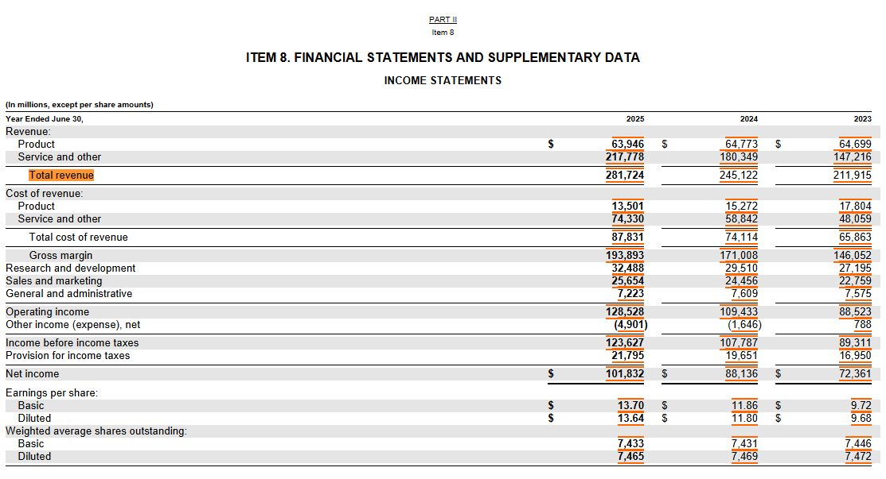
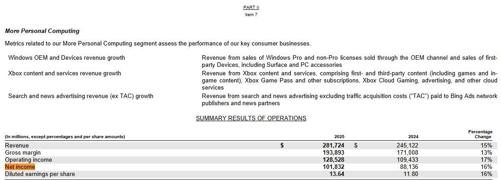
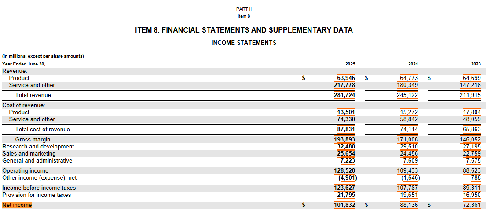
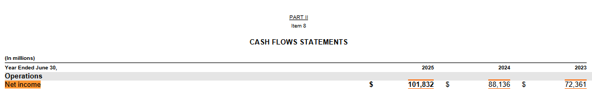
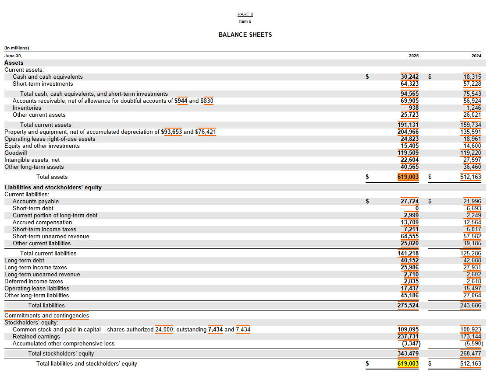
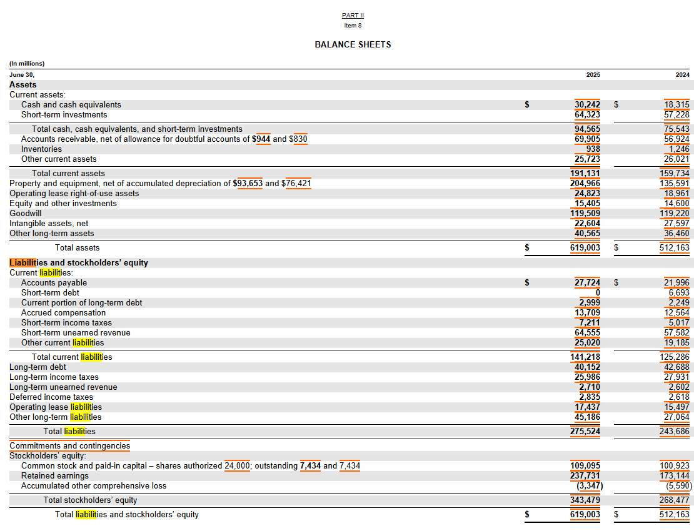
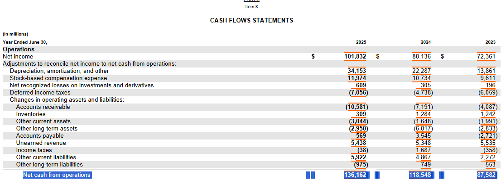
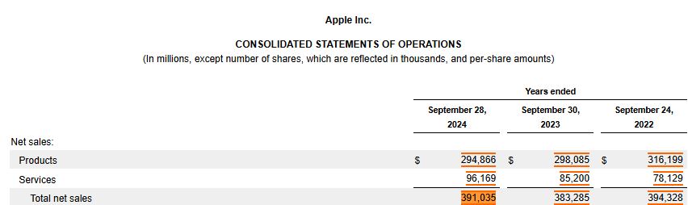

# Getting the data through scraping


<!-- WARNING: THIS FILE WAS AUTOGENERATED! DO NOT EDIT! -->

## Seting up the tools

Initiate a conda repo

> conda create -n my_env

Install the Python library to scrape data from SEC Edgar API

> uv add edgartools

Import package

Set your identity

``` python
set_identity("Ramon Pozuelo rapozueloruiz@gmail.com")
```

Now you can import Companies

``` python
apple = Company("AAPL")
# apple
```

Get the filing that we want (10 K of the previous year)

``` python
fillings = apple.get_filings(form="10-K", year=2024)
# fillings = apple.get_filings(form="10-K").latest()
```

Access the filing data

``` python
apple_latest_10K = fillings.latest()
apple_latest_10K
```

To donwload the filing content:

``` python
tenk = apple_latest_10K.obj()
tenk
```

The relevant information for the accounting is in : + Item 7
Management’s Discussion and Analysis (MD&A)

``` python
tenk["Item 7"]
```

``` python
apple.balance_sheet()
```

``` python
microsoft = Company("MSFT")
microsoft.balance_sheet(as_dataframe=True)
```

``` python
df = microsoft.balance_sheet(as_dataframe=True)
```

``` python
df.head()
```

# Manual notes

📈 **Total Revenue**  
+ **What it is**: The total amount of money a company earns from its
business activities, like selling products or services, before any costs
or expenses are deducted.

- **Where it appears**: First line of the Income Statement (also called
  the Consolidated Statement of Operations).

- **Why it matters**: It shows the company’s ability to generate sales.

💰 **Net Income** + **What it is**: The company’s profit after
subtracting all expenses, taxes, and costs from total revenue.

- Formula:  
  \> Net Income = Total Revenue - Total Expenses

- **Where it appears**: Bottom line of the Income Statement.

- **Why it matters**: It reflects the company’s overall profitability1 .

🏢 **Total Assets** What it is: Everything the company owns that has
value—cash, inventory, buildings, equipment, patents, etc.

- **Where it appears**: Top half of the Balance Sheet.

- **Why it matters**: It shows the scale and resource base of the
  company

📉 **Total Liabilities** + **What it is**: All the debts and obligations
the company owes—loans, accounts payable, accrued expenses, etc.

- **Where it appears**: Bottom half of the Balance Sheet, usually under
  or alongside shareholders’ equity.

- **Why it matters**: It indicates how much the company owes and its
  financial risk exposure2 .

🔄 **Cash Flow from Operating Activities** + **What it is**: The cash
generated or used by the company’s core business operations (e.g.,
selling products, paying suppliers).

- **Where it appears**: First section of the Cash Flow Statement.

- **Why it matters**: It shows whether the company’s day-to-day
  operations are generating enough cash to sustain the business .

``` python
columns = ["Company", "Year",
            "Total Revenue", "Net Income", 
            "Total Assets", "Total Liabilities", 
            "Cash Flow from Operations"]
```

``` python
# In millions except for share amounts 
rows = [
      # [" company ", year, TReven, NIncome, TAssets, TLiab, CashFlOp
        ["Microsoft", 2025, 281724, 101832, 619003, 191791, 93520],
        ["Microsoft", 2024, 245122, 88136,  512163,  ],
        ["Microsoft", 2023, 211915, 72,361,   ],
        ["Apple", 2024, 391035, 101832, 619003, 191791, 93520],
        ["Apple", 2023, 383285, 101832, 619003, 191791, 93520],
        ["Apple", 2022, 394328, 101832, 619003, 191791, 93520],
        
        ]
```

Microsoft 10K

<figure>

<figcaption aria-hidden="true">image.png</figcaption>
</figure>

Microsoft Net income

<figure>

<figcaption aria-hidden="true">image.png</figcaption>
</figure>

<figure>

<figcaption aria-hidden="true">image.png</figcaption>
</figure>

<figure>

<figcaption aria-hidden="true">image.png</figcaption>
</figure>

Net income appears in multiple places and with the same values. In the
previous pictures: Item 7, Item 8 (Income Statements), Item 8 (Cash Flow
Statements), Item 8 (Income Statements), Item 8 (STOCKHOLDERS’ EQUITY
STATEMENTS)

Total Assets: In Balance Sheets  
| 2025 | 2024 | |———–|———| | $ 619,003 | $512,163|

<figure>

<figcaption aria-hidden="true">image.png</figcaption>
</figure>

Liabilities

<figure>

<figcaption aria-hidden="true">image.png</figcaption>
</figure>

Cash Flow

<figure>

<figcaption aria-hidden="true">image.png</figcaption>
</figure>

Apple

Total revenue / Total net sales

<figure>

<figcaption aria-hidden="true">image.png</figcaption>
</figure>

# Test to get the total revenue for apple and microsoft

With this code I get the full text of each section or “Item”

``` python
apple10k = apple.get_filings(form="10-K").latest().obj()
print(apple10k.items)
print(100*"-")
print()
n="7"
print(apple10k[f"Item {n}"])
```

Now Let’s try to import with xbrl

``` python
apple10k = apple.get_filings(form="10-K").latest().xbrl()
display(apple10k)
```

``` python
dir(apple10k)
```

``` python
apple10k.statements.income_statement()
```

``` python
dir(apple10k.facts)
```

``` python
apple10k.facts.search_facts("Net")
```

``` python
apple10k.facts.to_dataframe()
```
