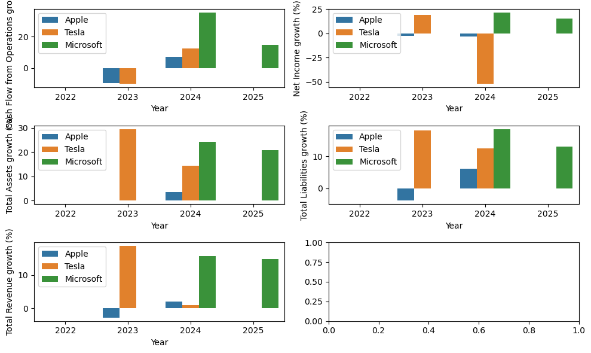
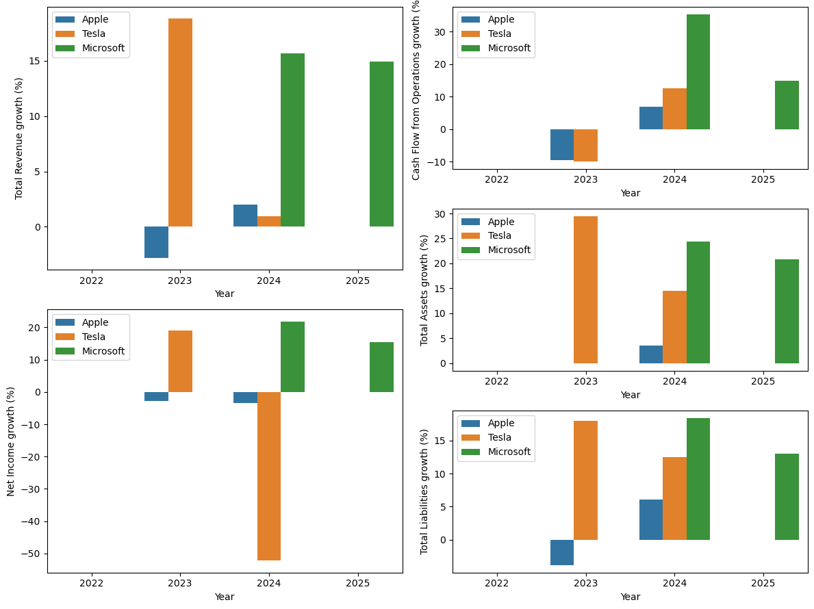

# Load data / Manually input the data


<!-- WARNING: THIS FILE WAS AUTOGENERATED! DO NOT EDIT! -->

``` python
path_to_data = Path("../resources")
```

Creation of the csv file

``` python
# columns = ["Company", "Year",
#             "Total Revenue", "Net Income", 
#             "Total Assets", "Total Liabilities", 
#             "Cash Flow from Operations"]
# df = pd.DataFrame(columns=columns)
# df.to_csv(path_to_data/"financial_data.csv", index=False)
```

Import csv into pandas

``` python
file=path_to_data/"financial_data.csv"
df = pd.read_csv(file)
df.head()
```

<div>
<style scoped>
    .dataframe tbody tr th:only-of-type {
        vertical-align: middle;
    }
&#10;    .dataframe tbody tr th {
        vertical-align: top;
    }
&#10;    .dataframe thead th {
        text-align: right;
    }
</style>

<table class="dataframe" data-quarto-postprocess="true" data-border="1">
<thead>
<tr style="text-align: right;">
<th data-quarto-table-cell-role="th"></th>
<th data-quarto-table-cell-role="th">Company</th>
<th data-quarto-table-cell-role="th">Year</th>
<th data-quarto-table-cell-role="th">Total Revenue</th>
<th data-quarto-table-cell-role="th">Net Income</th>
<th data-quarto-table-cell-role="th">Total Assets</th>
<th data-quarto-table-cell-role="th">Total Liabilities</th>
<th data-quarto-table-cell-role="th">Cash Flow from Operations</th>
</tr>
</thead>
<tbody>
<tr>
<td data-quarto-table-cell-role="th">0</td>
<td>Microsoft</td>
<td>2025</td>
<td>281724</td>
<td>101832</td>
<td>619003</td>
<td>275524</td>
<td>136162</td>
</tr>
<tr>
<td data-quarto-table-cell-role="th">1</td>
<td>Microsoft</td>
<td>2024</td>
<td>245122</td>
<td>88136</td>
<td>512163</td>
<td>243686</td>
<td>118548</td>
</tr>
<tr>
<td data-quarto-table-cell-role="th">2</td>
<td>Microsoft</td>
<td>2023</td>
<td>211915</td>
<td>72361</td>
<td>411976</td>
<td>205753</td>
<td>87582</td>
</tr>
<tr>
<td data-quarto-table-cell-role="th">3</td>
<td>Apple</td>
<td>2024</td>
<td>391035</td>
<td>93736</td>
<td>364980</td>
<td>308030</td>
<td>118254</td>
</tr>
<tr>
<td data-quarto-table-cell-role="th">4</td>
<td>Apple</td>
<td>2023</td>
<td>383285</td>
<td>96995</td>
<td>352583</td>
<td>290437</td>
<td>110543</td>
</tr>
</tbody>
</table>

</div>

# Data preparation

## Percentage of change of each financial fact

Order by company and ascending year, for tools like .pct_change() whose
operations operates in rows such as:  
\>
(*r**o**w*<sub>*i* + 1</sub> − *r**o**w*<sub>*i*</sub>)/*r**o**w*<sub>*i*</sub>

``` python
df.sort_values(by=["Company", "Year"], inplace=True, ascending=[True, True])
df
```

<div>
<style scoped>
    .dataframe tbody tr th:only-of-type {
        vertical-align: middle;
    }
&#10;    .dataframe tbody tr th {
        vertical-align: top;
    }
&#10;    .dataframe thead th {
        text-align: right;
    }
</style>

<table class="dataframe" data-quarto-postprocess="true" data-border="1">
<thead>
<tr style="text-align: right;">
<th data-quarto-table-cell-role="th"></th>
<th data-quarto-table-cell-role="th">Company</th>
<th data-quarto-table-cell-role="th">Year</th>
<th data-quarto-table-cell-role="th">Total Revenue</th>
<th data-quarto-table-cell-role="th">Net Income</th>
<th data-quarto-table-cell-role="th">Total Assets</th>
<th data-quarto-table-cell-role="th">Total Liabilities</th>
<th data-quarto-table-cell-role="th">Cash Flow from Operations</th>
</tr>
</thead>
<tbody>
<tr>
<td data-quarto-table-cell-role="th">5</td>
<td>Apple</td>
<td>2022</td>
<td>394328</td>
<td>99803</td>
<td>352755</td>
<td>302083</td>
<td>122151</td>
</tr>
<tr>
<td data-quarto-table-cell-role="th">4</td>
<td>Apple</td>
<td>2023</td>
<td>383285</td>
<td>96995</td>
<td>352583</td>
<td>290437</td>
<td>110543</td>
</tr>
<tr>
<td data-quarto-table-cell-role="th">3</td>
<td>Apple</td>
<td>2024</td>
<td>391035</td>
<td>93736</td>
<td>364980</td>
<td>308030</td>
<td>118254</td>
</tr>
<tr>
<td data-quarto-table-cell-role="th">2</td>
<td>Microsoft</td>
<td>2023</td>
<td>211915</td>
<td>72361</td>
<td>411976</td>
<td>205753</td>
<td>87582</td>
</tr>
<tr>
<td data-quarto-table-cell-role="th">1</td>
<td>Microsoft</td>
<td>2024</td>
<td>245122</td>
<td>88136</td>
<td>512163</td>
<td>243686</td>
<td>118548</td>
</tr>
<tr>
<td data-quarto-table-cell-role="th">0</td>
<td>Microsoft</td>
<td>2025</td>
<td>281724</td>
<td>101832</td>
<td>619003</td>
<td>275524</td>
<td>136162</td>
</tr>
<tr>
<td data-quarto-table-cell-role="th">8</td>
<td>Tesla</td>
<td>2022</td>
<td>81462</td>
<td>12587</td>
<td>82338</td>
<td>36440</td>
<td>14724</td>
</tr>
<tr>
<td data-quarto-table-cell-role="th">7</td>
<td>Tesla</td>
<td>2023</td>
<td>96773</td>
<td>14974</td>
<td>106618</td>
<td>43009</td>
<td>13256</td>
</tr>
<tr>
<td data-quarto-table-cell-role="th">6</td>
<td>Tesla</td>
<td>2024</td>
<td>97690</td>
<td>7153</td>
<td>122070</td>
<td>48390</td>
<td>14923</td>
</tr>
</tbody>
</table>

</div>

The percentage change has to be applied to all the facts (all columns
except Company and Year)

``` python
cols_to_change = df.columns.difference(['Company', 'Year'])
cols_to_change
```

    Index(['Cash Flow from Operations', 'Net Income', 'Total Assets',
           'Total Liabilities', 'Total Revenue'],
          dtype='object')

To avoid applying the method co rows of different companies, groupby
Company

``` python
pct_change_df = df.groupby("Company")[cols_to_change].pct_change() * 100
# Add suffix to the new columns to indicate they are growth percentages
pct_change_df = pct_change_df.add_suffix(' growth (%)')
```

## Fill NA values that result from pct_change calculations with 0 or an appropriate value

``` python
pct_change_df.fillna(0, inplace=True)
```

We can add the new columns to the original dataframe

``` python
df_with_growth = pd.concat([df, pct_change_df], axis=1)
df_with_growth
```

<div>
<style scoped>
    .dataframe tbody tr th:only-of-type {
        vertical-align: middle;
    }
&#10;    .dataframe tbody tr th {
        vertical-align: top;
    }
&#10;    .dataframe thead th {
        text-align: right;
    }
</style>

<table class="dataframe" data-quarto-postprocess="true" data-border="1">
<thead>
<tr style="text-align: right;">
<th data-quarto-table-cell-role="th"></th>
<th data-quarto-table-cell-role="th">Company</th>
<th data-quarto-table-cell-role="th">Year</th>
<th data-quarto-table-cell-role="th">Total Revenue</th>
<th data-quarto-table-cell-role="th">Net Income</th>
<th data-quarto-table-cell-role="th">Total Assets</th>
<th data-quarto-table-cell-role="th">Total Liabilities</th>
<th data-quarto-table-cell-role="th">Cash Flow from Operations</th>
<th data-quarto-table-cell-role="th">Cash Flow from Operations growth
(%)</th>
<th data-quarto-table-cell-role="th">Net Income growth (%)</th>
<th data-quarto-table-cell-role="th">Total Assets growth (%)</th>
<th data-quarto-table-cell-role="th">Total Liabilities growth (%)</th>
<th data-quarto-table-cell-role="th">Total Revenue growth (%)</th>
</tr>
</thead>
<tbody>
<tr>
<td data-quarto-table-cell-role="th">5</td>
<td>Apple</td>
<td>2022</td>
<td>394328</td>
<td>99803</td>
<td>352755</td>
<td>302083</td>
<td>122151</td>
<td>0.000000</td>
<td>0.000000</td>
<td>0.000000</td>
<td>0.000000</td>
<td>0.000000</td>
</tr>
<tr>
<td data-quarto-table-cell-role="th">4</td>
<td>Apple</td>
<td>2023</td>
<td>383285</td>
<td>96995</td>
<td>352583</td>
<td>290437</td>
<td>110543</td>
<td>-9.502992</td>
<td>-2.813543</td>
<td>-0.048759</td>
<td>-3.855232</td>
<td>-2.800461</td>
</tr>
<tr>
<td data-quarto-table-cell-role="th">3</td>
<td>Apple</td>
<td>2024</td>
<td>391035</td>
<td>93736</td>
<td>364980</td>
<td>308030</td>
<td>118254</td>
<td>6.975566</td>
<td>-3.359967</td>
<td>3.516052</td>
<td>6.057424</td>
<td>2.021994</td>
</tr>
<tr>
<td data-quarto-table-cell-role="th">2</td>
<td>Microsoft</td>
<td>2023</td>
<td>211915</td>
<td>72361</td>
<td>411976</td>
<td>205753</td>
<td>87582</td>
<td>0.000000</td>
<td>0.000000</td>
<td>0.000000</td>
<td>0.000000</td>
<td>0.000000</td>
</tr>
<tr>
<td data-quarto-table-cell-role="th">1</td>
<td>Microsoft</td>
<td>2024</td>
<td>245122</td>
<td>88136</td>
<td>512163</td>
<td>243686</td>
<td>118548</td>
<td>35.356580</td>
<td>21.800417</td>
<td>24.318650</td>
<td>18.436183</td>
<td>15.669962</td>
</tr>
<tr>
<td data-quarto-table-cell-role="th">0</td>
<td>Microsoft</td>
<td>2025</td>
<td>281724</td>
<td>101832</td>
<td>619003</td>
<td>275524</td>
<td>136162</td>
<td>14.858117</td>
<td>15.539621</td>
<td>20.860546</td>
<td>13.065174</td>
<td>14.932156</td>
</tr>
<tr>
<td data-quarto-table-cell-role="th">8</td>
<td>Tesla</td>
<td>2022</td>
<td>81462</td>
<td>12587</td>
<td>82338</td>
<td>36440</td>
<td>14724</td>
<td>0.000000</td>
<td>0.000000</td>
<td>0.000000</td>
<td>0.000000</td>
<td>0.000000</td>
</tr>
<tr>
<td data-quarto-table-cell-role="th">7</td>
<td>Tesla</td>
<td>2023</td>
<td>96773</td>
<td>14974</td>
<td>106618</td>
<td>43009</td>
<td>13256</td>
<td>-9.970117</td>
<td>18.964010</td>
<td>29.488207</td>
<td>18.026894</td>
<td>18.795267</td>
</tr>
<tr>
<td data-quarto-table-cell-role="th">6</td>
<td>Tesla</td>
<td>2024</td>
<td>97690</td>
<td>7153</td>
<td>122070</td>
<td>48390</td>
<td>14923</td>
<td>12.575438</td>
<td>-52.230533</td>
<td>14.492862</td>
<td>12.511335</td>
<td>0.947578</td>
</tr>
</tbody>
</table>

</div>

## Optionally, you could summarize these findings for each company

``` python
df_with_growth.columns
```

    Index(['Company', 'Year', 'Total Revenue', 'Net Income', 'Total Assets',
           'Total Liabilities', 'Cash Flow from Operations',
           'Cash Flow from Operations growth (%)', 'Net Income growth (%)',
           'Total Assets growth (%)', 'Total Liabilities growth (%)',
           'Total Revenue growth (%)'],
          dtype='object')

``` python
summary = df_with_growth.groupby('Company').agg({
    'Total Revenue growth (%)': 'mean',
    'Net Income growth (%)': 'mean'
}).reset_index()

print("\nYear-over-Year Average Growth Rates (%):")
print(summary)
```


    Year-over-Year Average Growth Rates (%):
         Company  Total Revenue growth (%)  Net Income growth (%)
    0      Apple                 -0.259489              -2.057837
    1  Microsoft                 10.200706              12.446679
    2      Tesla                  6.580948             -11.088841

# Graphs

``` python
cols_to_change
```

    Index(['Cash Flow from Operations', 'Net Income', 'Total Assets',
           'Total Liabilities', 'Total Revenue'],
          dtype='object')

## Plot the percentage of change of the financial facts accross years

``` python
fig, axs = plt.subplots(3,2, figsize=(10, 6))

for col in cols_to_change:
    ax = axs.flatten()[cols_to_change.get_loc(col)]
    sns.barplot(data=df_with_growth, x="Year", y=f"{col} growth (%)", hue="Company", ax=ax)
    ax.legend(loc="upper left")
plt.tight_layout()
plt.show()
```



``` python
import matplotlib.gridspec as gridspec
```

``` python
cols_to_plot = ['Total Revenue', 'Net Income',
                'Cash Flow from Operations', 'Total Assets', 'Total Liabilities']

fig = plt.figure(figsize=(12, 9))

gs = gridspec.GridSpec(6, 2, figure=fig)
axs = []
ax0 = fig.add_subplot(gs[:3, 0])
ax1 = fig.add_subplot(gs[3:, 0])
ax2 = fig.add_subplot(gs[:2, 1])
ax3 = fig.add_subplot(gs[2:4, 1])
ax4 = fig.add_subplot(gs[4:, 1])
axs.extend([ax0, ax1, ax2, ax3, ax4])

for i, col in enumerate(cols_to_plot):
    ax = axs[i]
    sns.barplot(data=df_with_growth, x="Year", y=f"{col} growth (%)", hue="Company", ax=ax)
    ax.legend(loc="upper left")
plt.tight_layout()
plt.show()
```



- 2023 was not a good financial year and companies like Apple and Tesla
  have negative growth in their Cash Flow from operations, and even in
  2024 the consecuences of 2023 can be seen in the Net income growth and
  Total Revenue growth.
- Both Tesla and Apple have their main business related to selling
  physical products, however Microsoft is specialised in software and
  their growth is stable for the current data.

# Save dataframe

``` python
# Ensure target folder exists and save the dataframe
path_to_data.mkdir(parents=True, exist_ok=True)
output_file = path_to_data / "financial_data_chatbot.csv"
df_with_growth.to_csv(output_file, index=False)
print(f"DataFrame saved to: {output_file}")
```

    DataFrame saved to: ../resources/financial_data_chatbot.csv
